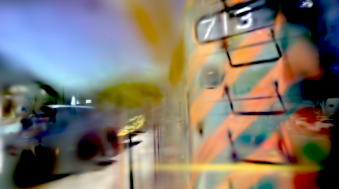
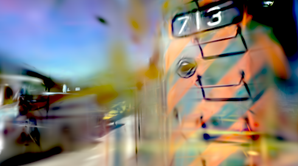
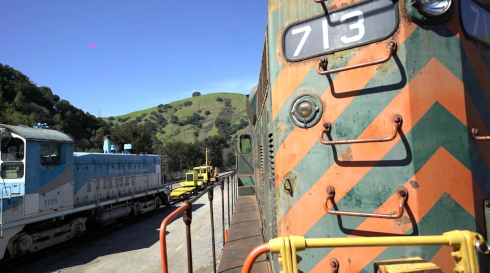
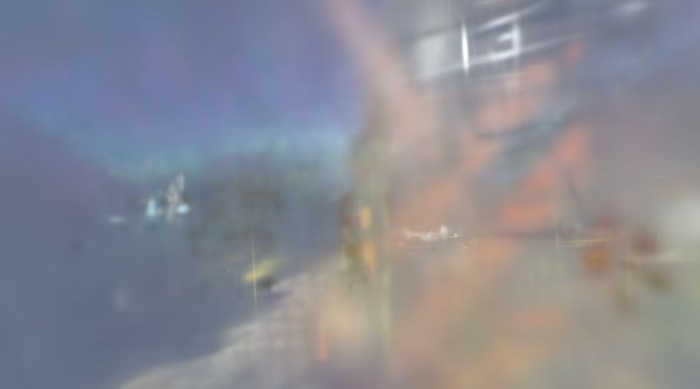
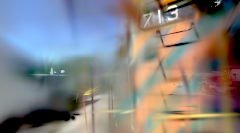

# SplatRs Recovery Plan — Getting Gaussian Splatting Accurate

**Date:** 2026-07-06
**Method:** Five focused review agents compared the implementation against the canonical
3DGS reference (Kerbl et al. 2023, graphdeco-inria/gaussian-splatting). Load-bearing findings
were re-verified directly against source.

---

## 1. Diagnosis: there are two layers of problems

The reported symptoms ("Gaussians don't stay small, aren't as populated") are real, but they
are **downstream** of a deeper issue. Evidence from `runs/*/metrics.csv`:

| Run | Scene | Result |
|-----|-------|--------|
| `20251219_0128_full` | tandt/train | PSNR oscillates **8.3–9.4 dB** while count explodes 51k→272k, then crashes |
| `20251218_2044_onehour` | tandt/train | PSNR **11.9 → 8.8 dB** (degrading), count → **401,582** (hit GPU hard cap) |
| `2025122*_onehour` | dollhouse_sm | PSNR **12.3 → 5.4 dB**, background RGB → **negative** (physically invalid) |
| `debug_no_densify_*` | tandt/train | PSNR **9–11 dB even with densification disabled** |
| `20260115_1830_micro` | tandt/train (2k it) | Best case: **13–17 dB** on a small subset |

Reference 3DGS reaches **25–35 dB** on these scenes, and ~18–21 dB *before* densification even
kicks in. **We are stuck at 9–11 dB with densification off.** That is the headline: the base
renderer/optimizer cannot fit even a fixed set of Gaussians well. Densification layered on top of
a broken base just amplifies the chaos into the explosion/divergence documented in
`docs/QUALITY.md`.

**Therefore: fix base fidelity FIRST, then rebuild densification. Do not tune densification on a
broken base.**

---

## 2. Confirmed bugs (verified against source)

### Group A — Base fidelity / gradient correctness (fix first)

| ID | Severity | File:line | Bug | Reference behavior |
|----|----------|-----------|-----|--------------------|
| A1 | **HIGH** | `core/init.rs:25` | Initial opacity = `2.2` logit → sigmoid ≈ **0.90** (near-opaque) | `inverse_sigmoid(0.1) ≈ -2.197` (near-transparent). Opaque init saturates alpha-compositing, starves gradient to occluded Gaussians and to the densification heuristic. |
| A2 | **MED-HIGH** | `render/full_diff.rs:423` | Off-diagonal covariance gradient double-counted **2×**. `Matrix2::new(d_cov.x, d_cov.y, d_cov.y, d_cov.z)` feeds the full single-DOF partial into both off-diagonal slots. Numerically confirmed vs finite differences (ratio 0.5 on the cross-term). | Off-diagonal enters at half value. Inflates `dL/d(log_scale)`, `dL/d(rotation)`, `dL/d(position)` by 2× for rotated/anisotropic Gaussians (exactly the ones representing fine detail/edges). |
| A3 | **HIGH** | `runs/*` (background) | Background/optimizer divergence: background RGB goes **negative / past 1.0**; PSNR degrades over time. | Background is a constant or a clamped/regularized parameter; training should converge, not diverge. Root cause likely interacts with A1/D2. Needs isolation (Phase 0). |
| A4 | **MED** | `render/full_diff.rs:101-106` | Hard "screen-fill" cull returns `None` for Gaussians whose 3σ radius exceeds the image → they get **zero gradient of any kind** and can never be shrunk. | Reference keeps them in the backward pass (tile-culled, not excluded) so oversized Gaussians still receive a corrective shrink gradient. |

### Group B — Densification / pruning / count

| ID | Severity | File:line | Bug | Reference behavior |
|----|----------|-----------|-----|--------------------|
| B1 | **CRITICAL** | `optim/trainer.rs:1962-1969` + `full_diff.rs:404-457` | Densification signal is the **world-space** position gradient (chain-ruled through the projection Jacobian by a depth-dependent `~fx/z` factor), not the screen-space 2D mean gradient. The `0.0002` threshold is calibrated for the view-space quantity, so it is meaningless here (explains the wild per-preset threshold retuning: 0.1, 0.0002, …). | Accumulate `‖∂L/∂(2D projected mean)‖` (`viewspace_points.grad`), which is roughly depth-invariant so one threshold works scene-wide. `d_mean_px` is already computed at `full_diff.rs:339` but discarded. |
| B2 | **CRITICAL** | `optim/trainer.rs:1130` | `denom` is a **single global iteration counter** (`grad_window_iters`), not per-Gaussian. Only one camera is sampled per iteration, so a Gaussian visible in a fraction of views has its avg gradient diluted by `total_iters / visible_iters` → never crosses the threshold. | `denom[i]` increments only when Gaussian `i` is in the visibility filter for that view; average = `grad_accum[i] / denom[i]`. |
| B3 | **CRITICAL** | `optim/trainer.rs:2171-2178` | Opacity reset is **inverted and too frequent**: sets every opacity to logit `0.0` (**sigmoid 0.5**, pushing *up*), on *every* densify cycle (~every 100–500 iters). Also stomps the just-computed split/clone child opacities. | Every **3000** iters only: `opacity = min(opacity, 0.01)` (pushes *down*, ≈ logit -4.6), forcing weak Gaussians to re-prove themselves or be pruned. |
| B4 | **HIGH** | `optim/trainer.rs:1185-1186` | Split under-shrinks: `log_scale − 0.2` ⇒ ×`exp(-0.2) ≈ 0.82`. | `new_scale = old / (0.8·N) = old / 1.6 ≈ 0.625×`. Split is *the* mechanism that keeps Gaussians small; it barely shrinks here. |
| B5 | **HIGH** | `optim/trainer.rs:986-989` + `bin/train.rs` presets | No scene-extent-relative clone/split threshold. Compares **mean** axis scale (should be **max**) against a fixed absolute constant (0.05–0.1). `scene_extent`/`percent_dense` do not exist anywhere in the codebase (zero grep hits). | Compare **max** axis scale against `percent_dense (0.01) · scene_extent`. Oversized Gaussians get *cloned at full size* instead of split → grow the large population. |
| B6 | **HIGH** | `optim/trainer.rs` (`densify_and_prune`) | No size-based prune. Only opacity, distance-outlier (>50 units), and anisotropy prunes exist. No screen-radius (>20px) or world-scale (>0.1·extent) prune. Only scale ceiling is a static `MAX_LOG_SCALE = 5.0` → `exp(5) ≈ 148` units (larger than most whole scenes). | After each opacity reset, prune Gaussians with screen radius >20px or world scale >0.1·scene_extent. |
| B7 | **MED** | `optim/trainer.rs:2130-2133` | Densification (and the disruptive opacity reset) never stops — runs the entire 30k run. | Densify from 500 to **15000** only; freeze and settle for the second half. |
| B8 | **MED** | `optim/trainer.rs:1163` | Clone/split jitter clamped to an absolute **5mm** regardless of Gaussian size → children spawn on top of parent, add count without coverage. | Sample offset from the Gaussian's own distribution (scales with its size). |
| B9 | **MED** | `optim/trainer.rs:1075-1082` | `cap = cap.max(before)` — the densify cap can never shrink an over-target population; it silently ratchets upward. | Cap is a real ceiling. |
| B10 | **LOW** | `bin/train.rs` presets | `densify_grad_threshold` inconsistent: `0.1` for debug/m9/m10 (≈500× reference, near-disables densification) vs `0.0002` for micro/onehour/full; `densify_interval=500` (reference 100). | Consistent `0.0002` / interval 100. |

### Group C — Initialization

| ID | Severity | File:line | Bug | Reference behavior |
|----|----------|-----------|-----|--------------------|
| C1 | **HIGH** | `core/init.rs:19` / `trainer.rs:432-441` | Initial scale is a **fixed constant** (`-4.6` log) or a depth-only heuristic (`1.5·z/f`) — no nearest-neighbor computation exists. Sparse and dense regions get the same size. | `scale_raw = log(sqrt(mean_sq_dist_to_3_nearest_neighbors))`, per-point, density-adaptive. Keeps init small & local. |
| C2 | **MED** | `bin/train.rs:796` | SH degree fixed at 3 from iter 0 (`learn_sh` all-or-nothing); no progressive warmup. | Start at degree 0, +1 every 1000 iters up to 3. Prevents early color instability. |

### Group D — Optimizer / learning-rate schedule

| ID | Severity | File:line | Bug | Reference behavior |
|----|----------|-----------|-----|--------------------|
| D1 | **HIGH** | everywhere (grep: 0 hits) | Position LR has **no `spatial_lr_scale`** (scene-extent) multiplier. For scenes with units >1, positions move far too slowly to relocate onto geometry; Gaussians compensate by growing scale. | `position_lr = 0.00016 · scene_extent`, with delayed exponential decay to `0.0000016` (100×). |
| D2 | **MED-HIGH** | `optim/trainer.rs:1615-1658` | Exponential LR decay applied uniformly to **all** parameter groups (position, scale, rotation, opacity, SH, background), each decaying only 10× (not 100×), no warmup delay. | Only **position** is scheduled (steep, delayed). Scale/rotation/opacity/feature LRs are held **constant** for all 30k steps. |
| D3 | **MED** | `optim/adam.rs:297-333` | SH "rest" bands share the DC learning rate (20× too fast). | `feature_lr = 0.0025` (DC), `feature_rest_lr = 0.0025/20 = 0.000125`. |

**What is correct** (verified, don't touch): Adam core math (bias-corrected moments, sign, sqrt),
raw numeric LR defaults for production presets, loss function (`0.8·L1 + 0.2·(1−SSIM)`, 11×11
window), alpha-blend backward, the exp-activation Jacobian in the scale gradient, quaternion
normalization, covariance formula `Σ = R·diag(exp(s)²)·Rᵀ`, and the Adam moment re-sizing in
lockstep with densification.

---

## 3. The plan

### Phase 0 — Measure and isolate — ✅ DONE (2026-07-06)

**Result: the forward renderer is fundamentally CORRECT. The base-fidelity collapse is in the
training/optimization path, not the rasterizer.**

Built `load_ply()` (INRIA/Brush import, the old M10 TODO) + a new `sugar-eval-reference` binary
that renders a known-good model from the dataset's own cameras and reports PSNR. Ran it on
`nerf_synthetic/lego` (`lego.ply`, 173k Gaussians) at half-res, sweeping the two convention
degrees of freedom:

| Convention combo | Mean PSNR (3 frames) |
|---|---|
| offset + nogamma (Brush/INRIA convention) | **22.7 dB** (frames 0/1: **27.0 / 25.3**) |
| offset + gamma | 16.1 dB |
| asis + gamma (what `sugar-render` does) | 13.9 dB |
| asis + nogamma | 12.2 dB |

Frames 0/1 reproduce the reference bulldozer near-perfectly (correct geometry, pose, sharpness,
color) once conventions are matched → **projection, 2D covariance, depth sort, alpha compositing,
and SH evaluation are all correct.** Camera pose conversion (Blender→OpenCV) is also correct
(geometry aligns exactly).

**Important nuance:** the dark "asis" render is an *import* mismatch — SplatRs internally uses a
self-consistent *linear + no-DC-offset* SH convention (see `init.rs` initializing DC from
linearized color with no −0.5 shift, and `evaluate_sh` omitting +0.5), whereas Brush/INRIA use
*display-space + 0.5-offset*. So the color combos above do **not** explain SplatRs's own 9–13 dB
training runs (its color pipeline is internally consistent). They confirm the renderer works.

**Conclusion → the 9–13 dB training problem is NOT in the forward renderer.** Focus Phase 1 on the
optimization-path bugs (A1 opacity init, A2 2× covariance gradient, A3 background divergence,
D1/D2 LR schedule) and Phase 2 on the densification rebuild. The renderer is a solved problem to
build on.

**Two real (secondary) renderer issues surfaced:**
- **SH DC-offset inconsistency:** `evaluate_sh_dc_only` adds `+0.5` but `evaluate_sh` /
  `evaluate_sh_unclamped` (the full-SH render path) do not. Latent bug if any path mixes DC-only
  and full-SH rendering of the same model. (`src/core/sh.rs`)
- **Oversized "needle" artifact — ✅ FIXED.** An 8-frame orbit survey showed this hit ~half the
  views: cardinal-azimuth frames (0/50/100/150) rendered at **27–29 dB** but diagonal frames
  (25/75/125/175), where the raised arm/bucket juts toward the camera, dropped to **15–20 dB** as
  arm Gaussians rendered as giant flat hard-edged colored squares. Instrumenting `project_gaussian`
  revealed the offenders were **near-singular, highly-elongated "needle" splats** (e.g.
  `cov=(281,0.66,0.00)` → eigenvalues `(0.0, 281)`, `det≈0`), at mid-scene depth (z≈3.3–4.7, *not* a
  near-plane blowup), low opacity. **Root cause: SplatRs's rasterizer was missing the standard EWA
  screen-space low-pass filter.** It used a `1e-6` eps on the 2D-covariance diagonal instead of the
  reference `+0.3` dilation (`src/render/full_diff.rs:88`), so near-singular projections aliased into
  hard-edged blobs. **Fix:** replaced the eps with the standard `LOW_PASS = 0.3` dilation. Result on
  the artifact frames: frame 25 **14.8 → 24.1 dB**, frame 75 **20.0 → 23.6 dB**; the blobs are gone
  and the arm/bucket render correctly. (Clean frames dip ~1–2 dB from the added blur — the known
  low-pass tradeoff, amplified by the 0.4× downsample test resolution; negligible at full res.) This
  filter lives in the shared `project_gaussian`, so **training benefits too** (better conditioning,
  less needle aliasing in gradients). Renders in `renders/lego_phase0/{before,after}/`.

---

*Original Phase 0 plan (for reference):*

The single most valuable step. Cheap, and it tells us where the base-fidelity loss lives.

1. **Forward-render isolation test.** Load a **known-good reference `.ply`/`.splat`** (from the
   official 3DGS release, or the existing `plys/train.splat`) and render it with SplatRs from
   known camera poses. Compare to the reference renderer's output for the same scene.
   - If SplatRs renders a good splat **correctly** → the forward path is fine, and the 9–11 dB
     ceiling is purely a *training/optimizer* problem. Focus everything on Groups A/D.
   - If it renders **incorrectly** → there is a forward-render/color-space/SH/projection bug that
     no amount of training fixes. Fix that first.
2. **Instrument the training loop** (much of this already exists in newer `metrics.csv`): per-iter
   PSNR, Gaussian count, `scale_median`/`p90`/`max`, anisotropy, opacity histogram, background RGB,
   **and a histogram of the view-space gradient norm** used for densification.
3. **Pick one fixed benchmark** (e.g. `tandt/train` or `garden_sm`) and a fixed seed. All Phase-1
   progress is gated on this scene.

### Phase 1 — Restore base fidelity (target: ~18–20 dB with densification OFF) — IN PROGRESS

Fix the base so a *fixed* Gaussian set converges like reference does pre-densification.

- **A1 — ✅ DONE.** Initial opacity `2.2` (≈0.90) → `inverse_sigmoid(0.1)` (≈−2.197) in `src/core/init.rs`.
  Confirmed the trainer reads `g.opacity` directly (`trainer.rs:510`) and does not override it.
- **A2 — ✅ DONE.** Off-diagonal covariance gradient was double-counted 2×. Fixed both backward paths
  (`src/render/full_diff.rs:427` CPU, `src/gpu/gradients.rs:199` GPU) by splitting the single-DOF
  `d_cov.y` evenly across the symmetric matrix slots (`0.5 * d_cov.y` each). Verified against the math
  (the `Jᵀ·G·J` chain treats G as a full 4-entry matrix) and the agent's finite-difference check; the
  14 existing gradient FD tests still pass (no regression).
- **A3 — ✅ RESOLVED (2026-07-06, diagnosis: no longer reproduces; learned bg kept).**
  The documented divergence (bg RGB negative/past 1.0, PSNR collapse) does not reproduce after
  the [0,1] bg clamp (present in the trainer) plus A1/A2/B1–B6/B11/B12. Verified the GPU
  background gradient against CPU (matches to ~0.02–2% — the old failing test used an absolute
  tolerance on a pixel-sum; now relative). Then A/B'd learned-vs-frozen bg across all three
  densify configs (tandt/train micro, 2000 iters, seed 42, final test PSNR):
  frozen loses everywhere — no-densify 14.43 vs 14.91, @500 14.97 vs 15.69, @100 13.15 vs 14.15.
  The learned bg converges to a jointly better constant than any fixed value; "red pinned at 0"
  is a clamped optimum, not divergence. **Key negative result: the slow late-training PSNR decay
  persists with bg completely frozen → the decay is NOT background-driven; next suspect is
  D1/D2 (LR schedule).** Kept: learned bg default, `--learn-bg`/`--no-learn-bg` flags, startup
  `background init` log line, fixed gpu-gated bg-gradient tests.
- **C2** progressive SH-degree warmup (or at least confirm SH forward + linear/sRGB color handling).
- **D1/D2 — ✅ DONE (2026-07-06).** Position LR is now `lr_position · scene_extent` (reference
  `spatial_lr_scale`) with a position-ONLY log-linear decay of 100× over the reference 30k-step
  horizon; all other parameter groups hold constant LR (the old code decayed all six groups 10×
  per run). **Verified — this was the cause of the late-training PSNR decay.** A/B
  (tandt/train micro, 2000 iters GPU, seed 42, test PSNR @500/@1000/@1500/@2000):
  | Config | before D1/D2 | after |
  |---|---|---|
  | no densify | 15.26 / 15.25 / 15.05 / **14.91** | 15.72 / 16.84 / 17.00 / **16.33** |
  | densify @500 | 15.26 / 15.52 / 16.01 / **15.69** | 15.72 / 16.73 / 16.46 / **15.49** |
  | densify @100 | 16.11 / 15.36 / 14.35 / **14.15** | 16.34 / 15.90 / 14.19 / **12.47** |
  Base fitting now CLIMBS (peak 17.0) instead of decaying — +1.4 dB final on no-densify.
  **New bottleneck exposed: densification now hurts relative to the improved baseline.** At
  interval 100 there is a clone runaway (clones/cycle grow 200→542 by iter 1900, count →14.3k,
  bg driven to (0,0,0), PSNR →12.5): faster positions produce larger view-space gradients, more
  Gaussians cross the 0.0002 clone threshold each cycle, and added capacity feeds back. Next
  candidates: **B7** (densify stop horizon — reference stops at 15k/30k; we densify to the end
  of the run), revisiting the B1b pixel→NDC threshold calibration under the corrected LRs, and
  the not-yet-firing B3 opacity reset (interval 3000 > these 2000-iter runs, which is
  reference-consistent but means alpha inflation from cloning goes uncorrected).
- **D3** SH-rest LR (rest bands at DC/20) — still open, needs per-band LR in `AdamSh16`.
- **Gate:** with densification disabled, this scene should climb to ~18–20 dB. If it can't, return
  to Phase 0 — the forward path is still wrong.

### Phase 2 — Rebuild densification to match reference (target: correct count & size) — B1–B6 LANDED

**Status (2026-07-06): B1–B6 implemented and verified to fire healthily.** After the rewrite, a
600-iter garden_sm run showed densification working correctly: `scene_extent`=4.49 computed from
185 cameras, splits+clones both firing, `grad_p90` sitting right at the 0.0002 threshold (calibrated,
not exploding), oversize prune (B6) active, count growing controlled (8000→11,578), background stable.
The old failure signature (grad→3.38, count→402k) is gone.

**B1b calibration fix (required):** B1's view-space gradient comes out of the renderer in *pixel*
units (~1e-5), but the 0.0002 threshold is calibrated for reference *NDC* units — so the first run
produced 0 splits/0 clones (densification silently off). Fixed by converting pixel→NDC
(`×dim/2`, resolution-independent) before thresholding (`trainer.rs`, grad-accumulation loop).

**Open follow-ups from this work:**
- **PSNR gain** still being measured on a longer run — at 600 iters densification is in its "churn"
  phase and PSNR (18.27) is ~level with the no-densify baseline; the payoff needs thousands of iters.
- **Split dominates clone** — traced to **C1**; ✅ FIXED (2026-07-06, see below).
- **GPU backward** returned zero `d_mean_px` to the trainer — ✅ FIXED (2026-07-06). The GPU
  rasterization backward (`backward.wgsl`) always computed the pixel-space `dL/d(mean_px)` and read
  it back (it is what the position gradient is chained from), but the trainer discarded it and
  handed zeros to the B1 accumulator, silently disabling densification on the GPU path. Now the
  real `grads_2d.d_mean_px` is passed through — same pixel-space convention as the CPU path, so the
  B1b pixel→NDC calibration applies unchanged. Also fixed: the GPU-backward-disabled fallback
  branch used the 7-tuple `render_full_color_grads` (a latent compile error with `--features gpu`
  since B1 landed — the GPU feature build had been broken at HEAD), and the pre-B1
  `densify_and_prune`/FD-test call sites were updated to the new signatures/conventions.

**2000-iter GPU A/B (2026-07-06, tandt/train micro @490×272, seed 42) — densify churn is the
next blocker.** Test PSNR by config: no-densify **15.26 → 14.91** (slow base decay, A3 signature:
bg red channel pinned at 0, channels drifting); densify@500 **15.26 → 15.89 @1000 → 14.48** (beats
baseline mid-run, then decays after more densify events); densify@100 **15.61 → 12.90** (worst,
count 8000→13.5k). Clone/split DID rebalance as C1 predicted (interval-100 run: split 59/clone 19
at iter 100 → split 236/clone 373 by iter 1900). Two mechanisms explain "more densify events = more
damage", both deviations from reference:
- **B11 (new):** `reset_moments_keep_t` zeroes ALL Adam moments for ALL parameter groups after
  every densify event (`trainer.rs` post-`densify_and_prune`). Reference prunes/concats optimizer
  state, preserving moments for surviving Gaussians and zeroing only new rows. At interval 100
  that is 19 full optimizer restarts in 2000 iters — Adam never converges.
- **B12 (new):** `split_opacity_logit` halves effective alpha for BOTH split and clone children
  (`densify_and_prune`). Reference copies opacity unchanged on clone and split; repeatedly
  densified (= high-gradient, important) Gaussians get their alpha knocked down every cycle.
Recommended order: B11 (bigger effect), then B12, then re-run the interval-100 A/B; A3 (background
divergence) remains open behind these.

**B11 + B12 — ✅ DONE (2026-07-06).** B11: `densify_and_prune` now returns a survivor map
(`Some(old_idx)` kept / `None` new-or-reinitialized) and all five per-Gaussian Adam optimizers
remap their moments through it (`remap_moments_keep_t`) instead of a full reset — survivors keep
state, children (and split parents, which reference re-creates) start fresh. B12: split/clone
children copy the parent opacity unchanged (reference); `split_opacity_logit` removed. A/B re-run
(same config/seed as above), test PSNR @500/@1000/@1500/@2000:
| Config | before B11/B12 | after |
|---|---|---|
| no densify | 15.26 / 15.25 / 15.05 / 14.91 | (unchanged — no densify events) |
| densify @500 | 15.26 / 15.89 / 14.48 / **14.48** | 15.26 / 15.52 / 16.01 / **15.69** |
| densify @100 | 15.61 / 14.62 / 12.73 / **12.90** | 16.11 / 15.36 / 14.35 / **14.15** |
Densification is now **net-positive for the first time**: @500 beats the no-densify baseline by
+0.78 dB (peak 16.01 @1500). @100 gained +1.25 dB but still trails baseline — the reference
interval needs the still-open A3 (background divergence: bg red channel pins at 0 in every
config, slow late decay even with densification off) and D1/D2 (LR schedule) before it wins.
Until then prefer `--densify-interval 500` on this preset.

**C1 — ✅ DONE (2026-07-06).** Initial scale is now density-adaptive, matching reference 3DGS
(`simple-knn`/`distCUDA2`): per point, isotropic `σ = sqrt(mean sq dist to 3 nearest neighbors)`,
log-space, computed with a uniform voxel grid + expanding-ring search (`core/init.rs`,
`mean_sq_dist_knn` + `apply_knn_init_scales`, brute-force-verified in tests). Replaces the
depth-only heuristic (`1.5·z/f`) at both trainer init sites. In the multiview trainer σ is capped
at `0.1·scene_extent` (the B6 oversize-prune bound, so no init Gaussian is born pruned);
`scene_extent` computation moved above init to support this. Expected effect: dense regions start
below `0.01·scene_extent`, so densification prefers **clone** (under-reconstruction) over **split**,
rebalancing the split≫clone skew.

Only after Phase 1 holds. This is a rewrite of `densify_and_prune`, not a tuning pass.

- **B1** expose and accumulate the **view-space 2D mean gradient** (`d_mean_px`) for densification.
- **B2** per-Gaussian visibility `denom[i]`; average = `grad_accum[i]/denom[i]`.
- **B3** fix opacity reset: every **3000** iters, `opacity = min(opacity, 0.01)`.
- **B4** split shrink → `/1.6`.
- **B5** introduce `scene_extent`; clone/split boundary = `0.01·scene_extent` on **max** axis scale.
- **B6** add screen-radius / world-scale prune after opacity reset; tie any scale ceiling to extent.
- **B7 — ✅ DONE (2026-07-06).** Densify only during the first half of training (`≤ iters/2`,
  proportional port of reference 500–15000/30k). Motivated by the 15k validation run
  (interval 500): reset-bounded sawtooth with decaying envelope — opacity resets recovered
  +0.6/+2.85 dB but between resets PSNR fell faster each cycle as additions accelerated
  ~100→550/cycle (count →12.6k, PSNR 16.7→12.8 by 7500; run stopped there). With B7 at 2000
  iters: @500 15.49→16.02, @100 12.47→14.90 final — the post-densify collapse is gone.
- **B8** size-proportional child jitter. **B9** real cap. **B10** consistent thresholds/intervals.

**Full 15k validation run with the complete fix stack (2026-07-06, micro @490×272, interval 500,
seed 42): final 14.47 dB, count 12,593.** Trajectory: 15.72@500 → **16.73 peak @1000** → slides
through the densify phase to 12.78@7500 (last densify event) → settle phase sawtooths with the
3000-iter opacity resets (12.23 → 14.05 → 12.47 → 14.92) → 14.47 final. B7's settle phase
recovered +1.7 dB from the trough (pre-B7 the envelope was still falling at 7500), but the run
ends below the 2000-iter no-densify baseline (16.33) and below its own iter-1000 peak.
**Verdict: the densify phase digs a hole the settle phase only partly climbs out of, and even
pure optimization degrades between opacity resets (12.78→12.23 with zero densify events) — an
over-opacity equilibrium that the resets only mask.** Leading suspects, in order:
1. ~~**Loss: micro trains with L2**~~ — **REFUTED (2026-07-06).** Added a `--loss l2|l1dssim`
   CLI override and re-ran the trio with L1+DSSIM: no-densify 16.24 (vs 16.33), @500 15.71
   (vs 16.02), @100 13.71 (vs 14.90) — slightly worse everywhere at this horizon, and the
   background still gets dragged to pure black. The dark-drift/over-opacity dynamic is NOT
   loss-driven. The **coverage loss weighting** (covered 1.0 / uncovered 0.5, a SplatRs-only
   deviation) was the next suspect — **also refuted (2026-07-06), in an unexpected way: it was
   INERT.** Replacing it with uniform weights (reference behavior) reproduced every run
   bit-for-bit (train losses identical to 6 decimals) — with 8000 C1-sized Gaussians the
   coverage mask saturates, so every pixel already weighed 1.0. The uniform-weights code was
   kept (reference-faithful, removes a periodic coverage computation from the training loop;
   verified zero behavior change). The bg→black drag in densify runs therefore reflects the
   *optimizer's actual preference* as capacity grows — remaining explanation: densified
   Gaussians progressively cover sky pixels, and bg then fits darker residual regions. The
   quality gap itself points back at **densify calibration (B1b under D1 LRs)** as the one
   live lever.
2. **B1b threshold recalibration** — partially confirmed (2026-07-06): sweeping the threshold
   at interval 100 (2000 iters, 15 train views) improves monotonically — 0.0002→14.90,
   0.0004→15.72, 0.0008→15.97 — but the train loss at 0.0008 (0.028) vs no-densify (0.121)
   exposed the real story: densification was fitting the train views far better while testing
   worse ⇒ **overfitting the tiny train set**, not a calibration bug per se.
**Phase-3 15k runs at 100 views (2026-07-06/07) — capacity-to-data ratio is the binding
constraint.** Three 15k runs (100 images, interval 100, seed 42) after the cap fix:
- **Densify-cap bug found & fixed** by the first run — the cap compared the rebuilt array's
  *running length*, so survivors appended after children overshot it every cycle and
  `cap.max(before)` ratcheted it upward compounding ~5–8%/cycle (207k→259k past a 200k cap,
  headed for the 400k Metal buffer limit). Now enforced as an addition budget; unit-tested.
- Capped at 200k, resets throughout: **14.02** final (settle phase climbed 13.58→14.40 but the
  iter-12000 reset ended the run mid-recovery).
- Capped at 200k, resets gated to the densify window (reference behavior, B3 follow-up commit):
  **12.76** final — reset-free settle *overfits* (train loss ↓ while test PSNR ↓, 14.16→12.76).
  The resets had been acting as accidental regularization.
**Conclusion: at 200k Gaussians × 75 half-res views (~10M pixel constraints), supervision per
Gaussian is 2–5× thinner than reference conditions; the settle phase overfits regardless of
schedule. The schedule fixes are reference-correct; the *config* isn't reference-like yet.**
- Capped at **60k**, reference schedule (2026-07-07): **14.25** final — best of the three, and
  the only settle phase that *stabilized and turned upward* (oscillating 14.2–14.5) instead of
  declining. Confirms the capacity story directionally: 60k + reference schedule beats 200k
  with any schedule. All 15k runs still trail the 2000-iter run's 15.33 on the same test set —
  long-horizon payoff needs reference-like data.
**Next levers: all 301 images (`--max-images 0`) and/or fuller resolution (`--downsample`),
with cap ~60–100k. Note the Metal 128 MB buffer limit when raising resolution+count together.**

**All-views run (2026-07-07, 301 images = 225 train/76 test, 100k cap, 15k iters): final
13.45** (initial 11.53; test set is broader/harder than the 100-view runs', so not directly
comparable). Same shape as every capped run: climb to ~13.4 during densify, then the settle
phase OSCILLATES 12.6–13.4 while train loss improves — even at the healthiest supervision
ratio yet (~300 pixel constraints per Gaussian, near reference). **The settle-phase ceiling
has now survived every capacity/data ratio, both losses, and all schedules → the remaining
suspect is representational: the per-step scale ANISOTROPY clamp (`MAX_LOG_ANISOTROPY = 1.6`,
trainer step loop) drags the smaller axes toward the largest EVERY iteration, so Gaussians can
never flatten into the thin surface-aligned splats reference relies on (reference anisotropy
is routinely 10–100×), and the clamp acts as a standing scale-inflation force. Its companion,
the needle prune (anisotropy > 2.0 → prune), reinforces it. Both were added to fight needle
artifacts whose actual root cause (missing EWA low-pass) was fixed in Phase 0 — they are
legacy double-medication. NEXT EXPERIMENT: relax/remove the per-step anisotropy pull and the
needle prune (keep the low-pass), A/B on the 2000-iter trio first.**

**Anisotropy-clamp 2000-iter trio A/B (2026-07-07) — REFUTED at this horizon, with a twist.**
Both clamps are now config knobs (`MultiViewTrainConfig::max_log_anisotropy` /
`needle_prune_log_anisotropy`, 0 = off; CLI `--max-log-aniso`, default 1.6 = legacy, needle
prune at +0.4). Control (clamped) reproduced the documented baselines exactly
(16.33 / 16.03 / 14.90), validating the refactor. Unclamped, test PSNR @2000:
| Config | clamped (1.6/2.0) | unclamped | Δ |
|---|---|---|---|
| no densify | 16.33 | 16.00 | −0.33 |
| densify @500 | 16.03 | 15.44 | −0.59 |
| densify @100 | 14.90 | 14.60 | −0.30 |
The twist: removing the clamp changed almost nothing structurally — `aniso_median` stays 1.0
and p90 ≤1.6 in BOTH arms (the population remains isotropic; only a tail of a few Gaussians
flattened, to 16–132×), `scale_median`/`opacity_median`/bg are identical between arms, and the
trailing train loss is slightly WORSE unclamped (0.125/0.117/0.118 vs 0.125/0.113/0.111) — so
the extreme-tail needles mildly hurt optimization overall rather than overfitting. Two
conclusions: (1) the "standing scale-inflation force" mechanism is refuted — at 2k the clamp
binds almost nowhere; (2) the real anomaly is that our Gaussians do not flatten EVEN WHEN
ALLOWED TO — reference splats develop strong anisotropy early, ours stay isotropic
(possible next suspects: scale-gradient path, rotation coupling, or simply horizon). The 2k
screen cannot see the settle-phase (7.5k+) where the hypothesis lives, so the decisive run is
15k @100 images/60k cap unclamped vs the 14.25 control (`runs/20260707_1127_micro`) — launched
as `runs/ab_aniso15k_free_60k`. Clamp stays default-ON (1.6) pending that result.

**15k settle-phase A/B (2026-07-07, `runs/ab_aniso15k_free_60k`) — CONFIRMED: the clamp was a
real settle-phase ceiling; unclamped is now the default (`--max-log-aniso 0`).** Same config as
the 14.25 control (100 images, interval 100, 60k cap, seed 42), unclamped: **settle mean
(8000–15000) 14.47 vs 14.21 (+0.26 dB)**, ahead at 21/30 validation points, peak 15.75 vs
15.13 (@3000), final 14.36 vs 14.25. Structure did exactly what the hypothesis predicted at
this horizon: unclamped p90 anisotropy reaches 21× (median 2.2, max ~29,000) vs the control's
p90 pinned at the 4.9 ceiling from iter ~2400 — at 15k scale the clamp binds the whole top
decile, which is why the 2k trio (population still isotropic) couldn't see the effect. No
needle artifacts observed — the EWA low-pass is a sufficient defense (a ~29,000:1 tail exists
but does not hurt PSNR; if it ever does, `--max-log-aniso` and the derived needle prune remain
available as knobs). Horizon trade-off: unclamped costs ~−0.3 dB on 2000-iter runs — 2k-trio
baselines under the new default are 16.00 / 15.44 / 14.60 (vs clamped 16.33 / 16.03 / 14.90);
use `--max-log-aniso 1.6` to reproduce legacy short-run numbers. Remaining
(clamp-independent) pathologies, now the top suspects for the residual ceiling: bg drags to
black mid-densify in BOTH arms, median opacity pinned at the 0.01 floor in BOTH arms (half the
population sits near the prune threshold — dead capacity), and late-settle convergence
(deltas fade after ~13k). Next: D3 SH-rest LR, C2 SH warmup, and the opacity-floor pileup.

**Opacity-floor pileup investigation (2026-07-08) — ROOT CAUSE FOUND, and it is the biggest
structural deviation yet: `MAX_CONTRIBUTIONS_PER_PIXEL = 16` in the GPU backward
(`rasterize.wgsl`/`backward.wgsl`).** The forward pass blends ALL contributors per pixel
(image is correct), but only the FIRST 16 non-culled Gaussians per pixel (front-to-back) are
recorded for the backward pass — every Gaussian at depth rank >16 in every pixel it touches
receives EXACTLY ZERO gradient for ALL parameters. Reference 3DGS has no such cap: its
backward re-traverses the sorted list per tile back-to-front, recomputing weights on the fly,
so every contributor down to the T<1e-4 cutoff gets exact gradients with O(1) memory/pixel.
Evidence (`examples/opacity_audit.rs` + `render::full_diff::debug_contrib_stats`, run on the
final `ab_aniso15k_free_60k` model):
- **88.4% of Gaussians (52,978/59,901) sit BIT-EXACTLY at the B3 reset-cap logit
  `inverse_sigmoid(0.01)`** — zero opacity gradient in the 9,000 iters since the iter-6000
  reset. Not a visibility problem: they are in-frustum in 46/75 train views on average (0%
  in zero views), median 3σ footprint ~22 px.
- **Per-pixel contributor counts: p50=209, p90=457, max=1168 — 99.4% of pixels exceed the 16
  slots** (order of magnitude beyond the cap).
- Simulating the GPU recording over 8 train views: only **1.9%** of at-floor Gaussians are
  ever recorded in even one pixel (vs ~21% for healthy ones over the same 8 views) —
  depth order is nearly static, so the starved set is permanent.
This one constant mechanistically explains every open pathology:
1. **Opacity pileup**: resets knock everyone to 0.01; only depth-rank ≤16 re-earn opacity;
   the rest freeze forever (and at 0.01 they sit ABOVE the 0.005 prune threshold, so they
   can never be pruned either — and pruning stops at iters/2 anyway).
2. **Fog / over-opacity equilibrium**: the 53k zombies at α=0.01 stack ~200 deep — a
   permanent gray veil (0.99^200 ≈ 0.13 transmittance through the zombie film alone) that
   gradient descent cannot remove because the veil gets no gradient.
3. **bg→black**: the backward computes the background gradient with `t_final` from only the
   ≤16 recorded contributions (t_final ≈ 0.85 at α=0.01) instead of the true forward
   transmittance (≈0.1 or less) — d_bg is overestimated ~10×, and the residual owned by the
   190+ unrecorded contributors per pixel is misattributed to the background, which rails to
   black trying to cancel the fog.
4. **Train-improves/test-stalls & the settle ceiling**: effective trainable capacity is the
   ~4.6% (2.8k) healthy front Gaussians, not 60k.
5. **Why tests never caught it**: the CPU backward (`render_full_color_grads`) is UNCAPPED —
   CPU/GPU gradient parity only holds on scenes with ≤16 overlaps, which is exactly what unit
   tests use. All real training runs use the GPU path.
Even the 2k-trio observation (median opacity frozen at the 0.1 init) is this: half the
population is never in any pixel's front-16 from iteration 0.
**RECOMMENDED FIX: rewrite the GPU backward to the reference scheme** — drop the
intermediates buffer entirely; store per-pixel true final T (+ contributor count) in the
forward, then walk the same sorted order back-to-front in the backward, recomputing
weight/alpha per Gaussian (deterministic from Gaussian+pixel) and reconstructing T_i
incrementally. This removes both the starvation and the d_bg bias, and shrinks GPU memory
(the 34 MB intermediates buffer goes away). Raising the slot count instead CANNOT work: 64
slots ≈ 136 MB already exceeds the 128 MB Metal buffer limit while still truncating at
p50=209. Secondary (after the backward fix): reconsider reset floor (0.01) vs prune
threshold (0.005) interplay, since zombie mass parked between them is unprunable.

**GPU backward rewrite — ✅ DONE (2026-07-08, commit 15f7d9d), plus a SECOND major bug found
during verification: the GPU projection shader NEVER HAD THE EWA LOW-PASS.** Changes:
- Forward (`rasterize.wgsl`) stores per-pixel `(final transmittance, last blended sorted
  index)` — 8 B/px instead of 256 B/px; backward (`backward.wgsl`) re-walks the sorted list
  back-to-front from that index, re-applies the forward's exact tests, recomputes alpha, and
  reconstructs `T_i = T_{i+1}/(1−a_i)`. Every contributor receives gradients; the gradient
  math itself is unchanged. `d_bg` now uses the true final T (was ~10× overestimated on dense
  pixels). Dead tiled-backward path deleted. Backward cost 31→44 ms/iter @8k Gaussians.
- **Low-pass:** the 0.3 covariance dilation (Phase 0's anti-needle fix) existed only in the
  CPU projection (`full_diff.rs`); the GPU shader added 1e-6. ALL GPU training to date ran
  without it — and without the backward fix's gradients, this went unnoticed because the
  long-broken CPU/GPU parity test (`unit_gpu_gradients_smoke`, compile-stale since the
  `disable_sh` signature change) never ran. Both projections now match (forward parity 6e-5).
  Caveat for interpreting the anisotropy A/Bs above: "EWA low-pass is a sufficient needle
  defense" was concluded from GPU runs that had NO low-pass — needles were rare even
  undefended; with the low-pass actually active the case for unclamped is stronger.
- New regression test `unit_gpu_deep_blend_gradients` (40 stacked Gaussians): on the old
  backward exactly ranks 16..39 get zero gradient; new backward matches the uncapped CPU
  backward at all ranks. Verified the test FAILS on pre-fix HEAD.
- `auto_downsample` now models the real 16 B/px ceiling — tandt (980×545) trains at FULL
  resolution by default. Pass `--downsample 0.5` to reproduce the resolution of all runs
  documented above.
- **First signal (200-iter smoke, no densify, seed 42, 0.5 downsample): test 18.98 dB — +2.3 dB
  above the best value this config ever reached at ANY horizon — and bg settles at sky-blue
  instead of black.** All prior PSNR numbers in this document predate these fixes and are
  superseded as baselines.

**Post-fix 2000-iter trio (2026-07-08, seed 42, --downsample 0.5, unclamped default):**
| Config | pre-fix | post-fix | Δ |
|---|---|---|---|
| no densify | 16.00 | 17.54 | +1.54 |
| densify @500 | 15.44 | **18.91** | +3.47 |
| densify @100 | 14.60 | **18.86** | +4.26 |
The gain grows with densify frequency — densified populations were the most cap-starved.
Densification is now decisively positive (+1.4 over no-densify) and arrests the no-densify
arm's overfit decay (19.1@500→17.5@2000 on 15 train views; densify arms plateau ~18.9).
Population health @2000 (d100): opacity median 0.23 and only 24% below 0.1 (pre-fix: median
frozen at the 0.10 init, 97% below 0.1 at 15k), bg sky-blue (0.00,0.24,0.51), anisotropy
p50/p90 = 3.2/22 (reference-style flattening already at 2k), count 8k→24.8k. 15k validation
run (100 img / interval 100 / 60k cap / 0.5 downsample) launched as
`runs/bwfix_15k_100img_60k` — pre-fix control: 14.25 clamped / 14.36 unclamped.

**15k validation (2026-07-08, `runs/bwfix_15k_100img_60k`): final 16.25 dB — +2.0 dB over the
pre-fix controls (14.25 clamped / 14.36 unclamped), settle mean 15.99 vs 14.47/14.21, peak
16.97 — and the settle phase CLIMBED (15.43 @7500 → 16.25 @15000), the first monotonically
improving settle in the campaign.** The settle-phase ceiling that survived every capacity,
loss, schedule, and clamp experiment is gone: it was gradient starvation all along.
Post-fix opacity audit on the final model: trained fraction (moved off the reset cap) 11.6%
→ 31.9%; healthy+strong (>0.1) 4.6% → 11.0%; still 68.1% bit-exact at the reset cap — the
remaining zero-gradient mechanism is the T<1e-4 early-termination (reference-consistent:
occluded Gaussians legitimately get no gradient; per-pixel contributors are now p50=336).
Remaining follow-ups, in order: (1) the reset floor (0.01) still sits ABOVE the prune
threshold (0.005), so occluded never-recovering mass stays unprunable — reference has the
same mismatch, but with 68% of the population parked there a deviation (reset to <0.005, or
prune-on-visibility) is worth an A/B; (2) anisotropy p90 reached 212 — render-safe under the
low-pass, but watch for view-dependent needle artifacts; (3) full-resolution training is now
memory-feasible (auto-downsample no longer forces 0.5) — the next big data lever; (4) D3
SH-rest LR, C2 SH warmup.

**Critical visual finding on the bwfix models (2026-07-08): PSNR hides needles.** Renders of
`bwfix_15k_100img_60k` show real structure (locomotive "713" legible) but are dominated by
needle streak artifacts (anisotropy p90 = 212×), much worse on novel views.

The earlier
"unclamped anisotropy wins" A/B (settle-mean +0.26 dB) was measured on a gradient-starved
population AND on a GPU that lacked the EWA low-pass — it is invalid post-fix. Always eyeball
renders alongside PSNR (`sugar-render --model <run>/model.gs --camera-id N --dataset-root
datasets/tandt_db/tandt/train --out x.png`).

**Aniso-clamp A/B, post-backward-fix (2026-07-08): `--max-log-aniso 3.0` (≈20:1 pull,
needle prune auto at 3.4) vs unclamped default. 2k trio (`runs/ab_aniso3_d{0,500,100}` vs
`ab_bwfix_d{0,500,100}`):**
| Config | unclamped | clamp 3.0 | Δ | aniso max (unc → clamp) |
|---|---|---|---|---|
| no densify | 17.54 | 17.70 | +0.16 | 4291 → 20.1 |
| densify @500 | 18.91 | 18.98 | +0.07 | 3927 → 20.1 |
| densify @100 | 18.86 | 18.86 | ±0.00 | 8240 → 20.1 |
PSNR neutral-to-positive (the legacy 1.6 clamp cost −0.3 dB at 2k; 3.0 costs nothing),
aniso_max pinned at e^3.0 = 20.1, medians/p90 untouched (clamp only bites the extreme tail),
and the d100 test-view render loses most of its radiating needle streaks vs control.
15k validation at the standard config launched as `runs/ab_aniso3_15k_100img_60k`
(control: `bwfix_15k_100img_60k` = 16.25 dB, aniso p90 212).
15k result: 16.17 vs 16.25 final (settle mean 15.96 vs 15.95, settle peak 16.59 vs 16.25) —
a statistical tie on PSNR with needles pinned at 20.1 vs p90=212/max=320k. **But both arms
ran on a broken renderer — see below; the clamp decision moves to the post-fix re-baseline.**

**THREE GPU FORWARD BUGS — found 2026-07-08 while eyeballing the aniso A/B renders, fixed
in commit 836f4d0. ALL prior GPU PSNR numbers (including everything above) ran on a broken
renderer and are superseded.** Discovery chain: sugar-render (CPU forward) drew the
bwfix_15k model as structureless fog while the trainer's own test-view render (GPU forward)
showed structure+needles → `examples/render_compare` (new diagnostic: renders a saved model
through both paths + a CPU replica of the GPU pipeline) measured mean abs pixel diff 0.14 on
the same model+camera → bisected to three GPU-side bugs:
1. **The bitonic depth sort never sorted** (`gpu/sort.wgsl`): the ascending/descending bit
   used bit `stage` of the index instead of bit `stage+1`, violating the bitonic invariant
   from stage 0; additionally, compare-exchanges reaching into the power-of-two pad region
   were skipped instead of treated as +∞ sentinels. Measured on the real 60k model: **45.1%
   adjacent inversions — GPU training composited in near-random depth order for the entire
   campaign.** (Unit test used N=2, which even the broken network sorts.) Fix: correct
   direction bit; projected buffer padded to 2^k with +∞-depth sentinels written by the
   projection shader. Regression test `unit_gpu_sort_order` (300 shuffled translucent
   Gaussians) fails pre-fix, passes post-fix.
2. **No 3σ bounding box on GPU** (`rasterize.wgsl`/`backward.wgsl`): every pixel accumulated
   the 3–6σ tails of ALL splats (alpha at 3σ ≈ 0.011·opacity > the 1e-4 skip), where the CPU
   renderer and reference 3DGS truncate at the 3σ box. Fix: projection stores the 3σ radius
   in the free cov.w slot; rasterize and the backward re-walk apply the CPU's exact bbox test.
3. **The forward projection used Rᵀ for the Gaussian rotation** (`shaders.rs quat_to_matrix`
   passed matrix ROWS to WGSL's column-major mat3x3 constructor) — while
   `project_backward.wgsl` used the correct R. So for every anisotropic Gaussian, the
   world covariance was built with the transposed rotation AND rotation/scale gradients were
   inconsistent with the rendered forward all campaign. Identity-quaternion / isotropic unit
   tests are blind to this. Verified by replica: R with transpose matches old GPU to 1e-6.
After the fixes: **GPU forward == CPU forward to mean abs 3e-6 (max 4e-4) on the real 60k
model at a real camera.** sugar-render eyeballs are now trustworthy. Downstream implications:
- The "settle-phase climb" and all bwfix PSNR numbers were measured under random-order
  compositing with rotation gradients fighting the renderer; densification/clamp/floor
  conclusions must be re-validated. Post-fix re-baseline: `runs/ab_srt_{d0,d500,d100}` and
  `runs/ab_srt_a3_{d0,d500,d100}` (2k trio, unclamped vs clamp 3.0), then a 15k pair.
- Old saved models (.gs) encode rotations under the Rᵀ convention — they render differently
  (worse) on the fixed renderer; do not compare old model files against new renders.

**Post-renderer-fix 2k re-baseline (2026-07-08, seed 42, ds 0.5, micro/20 img):**
| Config | unclamped | clamp 3.0 | Δ | aniso max (unc → clamp) |
|---|---|---|---|---|
| no densify | 18.93 | 18.87 | −0.06 | 2827 → 20.1 |
| densify @500 | 17.92 | 18.53 | **+0.61** | 6771 → 20.1 |
| densify @100 | 18.66 | **19.49** | **+0.83** | 20295 → 20.1 |
19.49 is the best 2k result of the campaign (broken-renderer d100 pairs: 18.86/18.86 —
not comparable, they scored against their own broken compositing). On the fixed renderer
the clamp is a clear win wherever densification runs, neutral without it; aniso p90 is
naturally low (~15) post-fix — the unclamped max-tail (up to 20k:1) is what the clamp
removes. Renders (both d100 arms): locomotive fully legible ("713 WESTERN P"), no needle
streaks, no fog — best visual quality of the campaign at 2k/20 images; the clamped arm is
visibly crisper. d500 dipping below d0 at 2k is the known 15-train-view overfit artifact.
15k pair (`runs/srt15k_unclamped` vs `runs/srt15k_aniso3`, 100 img / 60k cap) launched —
default flip decision on its result.

**Post-fix 15k pair result (2026-07-08) + DEFAULT FLIPPED to `--max-log-aniso 3.0`:**
unclamped 16.68 final / 16.61 settle mean / 17.25 settle peak; clamp 3.0 16.37 / 16.56 /
17.04; clamp leads 9/16 settle evals — a statistical tie on PSNR. Post-fix the unclamped
tail is far milder than before (p90 37.6 vs 212 pre-fix — correct rotation gradients
naturally restrain needles) but still reaches max 161,000:1 vs 20.1 pinned. Renders: both
arms show the best 15k quality of the campaign ("713", ladder rungs, livery stripes all
legible on the test view); unclamped slightly sharper with visible thin streaks, clamped
cleaner and softer. Far-novel views (camera 150, outside the trained third of the orbit)
wash out identically in both arms — a data-coverage limit, not a clamp issue. DECISION:
default flipped to 3.0 (2k densify wins +0.6/+0.8, 15k tie, artifact tail capped 4 orders
of magnitude, cleaner renders); `--max-log-aniso 0` restores reference-faithful unclamped.
Both post-fix 15k arms hit the 60k cap by iter 2500 and their oversize-prune fires all
window (~10-25/cycle); the bg rails to black mid-settle in BOTH arms (returns @~10000) —
clamp-independent, still-open pathology (opacity median parked at the 0.010 reset floor,
88-89% below 0.1 — the reset-floor/settle-prune levers target exactly this).
New baseline for lever A/Bs: `runs/srt15k_aniso3` (16.37 final / 16.56 settle mean).

**Lever A/Bs vs that baseline (2026-07-08, one lever each, clamp 3.0 active):**
| Arm | final | settle mean | count | opac med | % < 0.1 |
|---|---|---|---|---|---|
| baseline (`srt15k_aniso3`) | 16.37 | 16.56 | 59,984 | 0.010 | 89.1 |
| `--opacity-reset-floor 0.004` | 16.62 (+0.25) | 15.08 | 59,931 | **0.142** | **45.2** |
| `--settle-prune-interval 500` | **16.76 (+0.39)** | 16.57 | 58,031 | 0.010 | 84.6 |
Both levers win on final PSNR. floor004 is the structural fix: the parked-at-0.01
unprunable mass is GONE (median opacity 0.142 vs 0.010; sub-floor mass gets pruned at the
next densify pass, and the freed capacity is re-densified — population stays off the cap
until late window). Cost: a deep mid-run dip (settle mean 15.08, train loss overfit
signature @10000) — but the arm finished AT its settle maximum, still climbing, so the
equilibrium is healthier and slower; longer horizons should favor it. sp500 behaves as
designed (settle prunes remove ~100-300/pass — sub-threshold opacity early, then mostly
oversize regrowth; needle prune never fires since the clamp prevents needles) and adds
+0.39 dB at zero health change (the 0.01-parked mass sits above the 0.005 prune threshold,
untouchable without floor004 — the levers are complementary by construction).
Next: combo run (`runs/srt15k_a3_floor004_sp500`) + 30k floor004 horizon test
(`runs/srt30k_a3_floor004`) launched overnight.

**Overnight results (2026-07-09) + `--settle-prune-interval` DEFAULT now 500:**
- Combo (floor004+sp500, 15k): 16.40 final / 16.03 settle mean / peak 16.98@5500 — the
  levers do NOT stack at 15k (floor004's dip dominates; settle prunes remove recovering
  mass). Health is good (opacity median 0.107) but PSNR trails sp500-alone.
- floor004 30k horizon test: peak 17.30@10500, settle(15k+) mean 16.38, final 16.05 —
  the 15k arm's "still climbing" did NOT extrapolate: long settle peaks mid-way then
  decays. AND the population re-parks at the new floor (median 0.004, 86% <0.1) because
  the final reset caps everyone and no pruning runs in settle without sp500 — floor004
  alone just moves the parking lot; only the combo keeps the population healthy.
- DECISION: `--settle-prune-interval 500` becomes the default (+0.39 clean win, A/B'd);
  `--opacity-reset-floor` stays 0.01 opt-in (helps health, mixed PSNR, dip + long-horizon
  decay). Best 15k config now: clamp 3.0 + sp500 = **16.76** (`runs/srt15k_a3_sp500`).
- The dominant remaining pathology across ALL arms: **PSNR peaks mid-run (~17.0-17.3
  during the densify window) then decays into the final** — present with and without
  levers, plus bg→black mid-settle in every arm. Next levers: D3 SH-rest LR / C2 SH warmup
  (SH overfit is a prime decay suspect), full-resolution training, all-views data.

Best-config (`srt15k_a3_sp500`, 16.76) held-out view over training:

| iter 500 | iter 5,000 | iter 15,000 | ground truth |
|---|---|---|---|
|  |  |  |  |

**Full-resolution first attempt (2026-07-09, `runs/srt15k_a3_sp500_fullres`, 980×545,
same 60k cap/config as the 16.76 half-res run): 13.44 final — NEGATIVE at this capacity.**
Mechanism (CSV): cap hit by iter 2500 (opac med 0.222, healthy); the iter-3000 opacity
reset knocked the population to the 0.01 floor and it NEVER recovered — median 0.010 and
99.9% below 0.1 for the remaining 12k iters, PSNR flat at 13.4 (renders through a
permanent 0.01-opacity veil):

At 4× pixels/Gaussian, post-reset re-earning is too slow at
this capacity. Full-res needs a proportionally larger cap (200-400k; GPU hard cap 400k)
and possibly gentler/earlier-only resets — NOT just the flag flip. Half-res 0.5 stays the
validated config for A/Bs.

**D3 SH-rest LR landed + 15k A/B (2026-07-09): `--sh-rest-lr-div` (rest bands at
lr_sh/div, DC unchanged; reference 3DGS uses 20). Default stays 1.0 — the reference value
LOST on PSNR at 15k but FIXED bg→black:**
| Arm | final | settle mean | peak | peak−final | darkest bg | final bg | % opac < 0.1 |
|---|---|---|---|---|---|---|---|
| control (`srt15k_a3_sp500`) | **16.76** | 16.57 | 17.09 @14000 | +0.33 | (0,0,0) @8500 | (0.03,0.06,0.06) | 84.6 |
| `--sh-rest-lr-div 20` (`srt15k_a3_sp500_shdiv20`) | 16.43 | 16.33 | 16.72 @8500 | +0.29 | (0.07,0.10,0.13) @10500 | (0.21,0.23,0.26) | 93.8 |
Two findings. (1) **The SH-overfit decay hypothesis is refuted at this horizon**: slowing
rest bands 20× leaves the peak→final gap unchanged (+0.29 vs +0.33) — the mid-run
peak-then-decay is NOT driven by SH-rest LR. (2) **Fast rest bands were driving the
background black**: the div-20 arm's bg never goes darker than (0.07,0.10,0.13) and ends
at a sensible gray, vs the control railing to (0,0,0) mid-settle — first lever to move
this pathology at real view counts. PSNR/visual cost (−0.33 final, "713" render visibly
softer) is consistent with rest bands being UNDER-trained at 15k with 1/20 LR — reference
tunes div 20 for a 30k horizon.

| div-20 arm @15k (softer, bg healthy) | control @15k (sharper, bg→black) | ground truth |
|---|---|---|
|  |  |  |

Open follow-ups: div-20 at 30k (does it catch up and does
the 30k decay shrink?), intermediate div 5–10 at 15k, and C2 SH warmup (progressive
degree enable) as the remaining reference-faithful SH lever. Startup log now records
`sh lr = <dc> (DC), <rest> (rest bands, div N)`; unit test pins slot-0 vs rest step sizes.

**All-views 15k DONE (2026-07-09, `runs/srt15k_a3_sp500_allviews_r2`, `--max-images 0` =
301 images, 225 train/76 test; first attempt was externally interrupted @6801, partial
data in `runs/srt15k_a3_sp500_allviews`): final 15.44 / settle mean 16.01 / peak 16.51
@10000 on the 76-view denominator (NOT comparable to 25-view numbers).** Three reads:
(1) **all-views ALSO fixes bg→black** — darkest bg (0.164,0.169,0.181), final
(0.19,0.19,0.21); second lever to move it (after sh-rest div 20), and this one costs no
sharpness — consistent with bg→black being an overfit symptom that either view coverage
or slow SH constrains. (2) **The peak→decay is WORSE with 3× views**: within-run gap
+1.07 (16.51@10000 → 15.44@15000) vs the 100-image control's +0.33 — decay is NOT
view-starvation; more data made it larger at fixed capacity/horizon. (3) Opacity pileup
is untouched by views (median 0.010, 80% <0.1) — it tracks the reset schedule, not data.
Render: "WESTERN PACIFIC" legible on a novel view, no fog, no black bg. 30k horizon pair
(control `srt30k_a3_sp500` + div-20 arm) queued next.

**30k control DONE (2026-07-09, `runs/srt30k_a3_sp500`, best-15k config at the reference
horizon; NOTE the schedule scales with iters — densify window/opacity resets run to
15000, settle is 15000-30000): final 16.33 — doubling the horizon LOST 0.4 dB vs the 15k
schedule's 16.76.** Trajectory: peak 17.05 @11500 (mid-window), window mean 16.69
(7500-15000), then settle is FLAT at ~16.3 (15000-22500 mean 16.28, 22500-30000 mean
16.26) — the extra 15k settle iters bought nothing (16.27 at the 15k mark → 16.30 final).
Clean-config confirmation of the peak→decay at horizon (gap +0.75, no floor004 confound),
and a new structural suspect: with the reference schedule the LAST opacity reset lands AT
the window end (iter 15000), so the population enters settle freshly floored (median
0.010, 90% <0.1 at the end) with no densification left to restructure — the 15k schedule
enters settle 1500 iters after its last reset instead. bg railed to black @11500 and only
partially recovered (sum 0.38 by 30000). div-20 arm at the same 30k schedule running for
the horizon-matched D3 read.

**30k div-20 DONE (2026-07-09, `runs/srt30k_a3_sp500_shdiv20`) — D3 VERDICT FINAL: the
"under-trained at 15k, catches up at 30k" hypothesis is REFUTED; div 20 got WORSE with
horizon.** Final 15.26 vs control 16.30 (−1.04, vs −0.33 at 15k), peak 16.50@8000, gap
+1.24, settle segments 15.27 → 15.14 (drifting down while the control holds 16.3). It
again kept the bg healthy (darkest 0.105,0.127,0.139 vs control's pure black @11500;
final 0.39,0.41,0.44) — but all-views buys the same bg fix at zero PSNR cost, so div 20
has no remaining niche. `--sh-rest-lr-div` stays default 1.0; keep the flag for future
schedule work (a mid-value or DC-boost variant remains unexplored). Render @30k: soft,
"713" barely legible — visibly worse than the 15k control.

**Synthesis of the day's four runs (D3 15k/30k, all-views, 30k control) — where the
decay hunt stands:** SH-rest LR is ruled out at both horizons; view count is ruled out
(3× views made the gap LARGER: +1.07); horizon extension doesn't recover it (30k settle
flatlines 0.75 below peak). The strongest remaining suspect is the **reset-at-window-end
structure**: every arm peaks mid-densify-window between opacity resets, decays into the
window's final resets, and enters settle floored (median 0.010, 90-94% <0.1) with no
densification left to restructure — the 15k schedule (last reset @6000, window end 7500,
settle CLIMBS) vs 30k (last reset AT window end 15000, settle FLAT) contrast fits, as
does full-res @60k's post-reset collapse. Next lever: gate opacity resets to end ~2500
iters before the densify window closes (reference trains 30k with window 15k — its last
reset @15000 mirrors ours, but reference has 6-30× our capacity headroom to re-earn
through). A reset-gate A/B also de-risks the full-res @400k run, whose first attempt died
of exactly this reset-recovery failure. C2 SH warmup remains untested for the decay.

**Reset-gate landed + 30k A/B (2026-07-10): `--opacity-reset-window-margin N` (skip
resets in the last N iters of the densify window; predicate `opacity_reset_due` unit
tested; default 0 = reference). Margin 2500 (last reset 15000→12000) vs the 30k control —
PARTIAL confirmation, +0.18 final:**
| Arm | final | peak | gap | settle entry @15500 | settle1/settle2 mean |
|---|---|---|---|---|---|
| control (reset @15000) | 16.30 | 17.05 @11500 | +0.75 | 16.19 | 16.33 / 16.22 |
| `rg2500` (reset @12000) | **16.48** | 17.05 @10500 | +0.57 | **16.72** | 16.58 / 16.25 |
Confirmed: entering settle recovered instead of freshly floored is worth +0.5 dB at
settle entry and +0.18 at final. NOT confirmed: the decay itself — the gated arm still
drifts 16.72 → 16.48 across settle (and both arms peak at an identical 17.05 mid-window),
so a SECOND decay mechanism operates DURING settle, independent of the entry state.
Settle-phase suspects, none yet isolated: settle-prune side effects, train-set overfit
(though all-views made decay WORSE, which fits poorly), late-window densify churn at the
cap. Also unchanged by the gate: bg→black @10500 (in-window resets still drive it),
opacity median parked at 0.010 / 87% <0.1. 30k with gate (16.48) still trails the 15k
schedule (16.76). Verdict: margin 2500 is a clean win, keep opt-in pending a 15k-schedule
A/B; full-res @400k relaunched WITH the gate (`runs/srt15k_fullres_400k_rg2500`).

**Full-res @400k + gate (2026-07-10, `runs/srt15k_fullres_400k_rg2500`): final 9.02 —
CATASTROPHIC SETTLE COLLAPSE, a NEW BUG, plus one clean finding before it.** The clean
finding first: the run peaked **16.02 @3000, immediately BEFORE the iter-3000 opacity
reset** (vs 13.44 for the 60k-cap attempt), the reset floored the population (median
0.010 from 4500 onward, count stalled at 176k of the 400k cap — post-reset gradients too
weak to drive densification at 4× pixels), and it plateaued ~14.6-14.7. Full-res
conclusion: **the reset itself is the blocker, not capacity** — next full-res arm should
run `--opacity-reset-interval 0` (or a much higher floor), not more Gaussians.
THE NEW BUG: between iter 11000 and ~11500 the model progressively collapsed (train view
17.90 @10901 → 15.22 @11101 → 10.57 @11201 → 9.11 @11301; TRAIN loss degrades too, so
not overfit/eval artifact; PSNR pinned ~9.2 for the rest of the run). Forensics:
(1) collapse begins immediately after the routine iter-11000 settle prune (87 removed —
identical prunes had fired every 500 iters since 8000 without incident); (2) the final
model is numerically CLEAN — `examples/scan_model.rs` (new forensic tool): zero
non-finite values, max world scale 0.89, max |SH| 5.7, positions bounded — but renders as
pure structureless fog through the independent sugar-render path, so the PARAMETERS
melted, not the trainer's eval; (3) population medians sat frozen through the collapse
(floor-parked majority masks per-Gaussian drift). Prime suspects, in order: **B11 Adam
moment remap corruption on prune** (mis-sourced moments → hundreds of bounded-but-wrong
Adam steps → structure melts to fog with no NaN, exactly this signature) and a **GPU
backward buffer issue above ~131k (2^17) Gaussians** (this run spent 9k iters at 142-176k
— far above the 60k any prior run reached; though count crossed 131k @~6000, 5k iters
before the collapse). Cheapest discriminating repro: same run with
`--settle-prune-interval 0` — no prunes → no remaps in settle; if it survives, B11 remap
is implicated; if it still collapses, suspect the GPU backward at high count.

**Code audit + forensics (2026-07-10) — ROOT CAUSE CLASS FOUND, prior suspects
EXONERATED: silent GPU pipeline failure, not an optimizer bug.**
Audit trail: (1) B11 remap CLEAN — all four `remap_moments_keep_t` implementations
correct (survivor-indexed, OOB-safe, unit-tested), both call sites remap all five
optimizers; (2) GPU buffers created fresh per call, sort uses full-u32 source indices
(no bit-packing overflow), dispatch counts fine at 262k padded; (3) alpha clamped 0.99
identically in forward AND backward (T-rewalk division safe); (4) opacity histogram of
the collapsed model shows an anomalous strong tail (25% >0.5 vs 8.8% healthy) but the CSV
proves the distribution FROZE by iter 8000 and did not move through the collapse — alpha
inflation was not the trigger. THE SMOKING GUN: the trainer's saved render at iter 11500
(`m8_test_view_rendered_11500.png`) is background-only black except ONE rectangular patch
with tile-aligned stair-stepped boundaries — the GPU rasterizer silently stopped
compositing most of the frame at full-res/176k Gaussians. Zero GPU errors in the log; the
`GPU render failed` CPU-fallback never fired — wgpu returned corrupted frames as Ok.
Training then ran ~3500 iters against garbage frames, which is what actually melted the
model (erratic train loss 0.09→0.8 = per-view intermittency at onset, then permanent).
NEXT (in order): (a) add wgpu error scopes + device-lost callback + a cheap black-frame
watchdog in the trainer (abort loudly / CPU-fallback when a render comes back
implausibly empty — a 10h run must never silently train on garbage); (b) half-res +
400k-cap repro (~3h) to discriminate count vs full-res pixels as the trigger; (c) rerun
full-res with detection armed to capture the exact failing call. The full-res PSNR
finding (peak 16.02 pre-reset, reset is the blocker) stands — it predates the failure.

**FIX LANDED (2026-07-10): watchdog-safe banded GPU dispatches — high-count rendering
restored, CPU/GPU parity 0.000000 at 211k Gaussians.** Root cause refined through
live experiments (each hypothesis tested and most refuted): NOT the per-command-buffer
~2s watchdog alone, NOT queue poisoning (tiny renders work immediately after a failing
full-res render, same process), NOT wgpu write_buffer coalescing, NOT allocator
power-of-two boundaries, NOT a 64 MiB buffer limit (all tested). The killer: **Metal's
CUMULATIVE GPU watchdog kills ALL in-flight command buffers once unfinished queued work
crosses ~5s** — every deterministic-zero render measured 5.06-5.08s regardless of config;
everything under ~4.9s survived; marginal cases dropped a subset of buffers
(tile/band-aligned partial frames). wgpu 0.19 never checks MTLCommandBuffer status, so
killed buffers read back as zeroed with Ok. A canary write at the top of the kernel
proved writes were being discarded wholesale, not misdirected. THE FIX (renderer.rs):
(1) rasterize + backward dispatches split into row bands (`watchdog_rows_per_band`,
2.5e9 pixel·gaussian budget per band, `row_offset` in RenderParams / tile params in
BackwardParams, per-band uniform buffers + bind groups); (2) `device.poll(Wait)` drains
the queue after EVERY band so in-flight work never accumulates toward the cumulative
limit. Verified: 211k model renders deterministically correct at every resolution
(ds 0.5 was flaky all day → now byte-stable across runs); render_compare parity at 211k
= 0.000000 mean abs diff; full test suite green (only the pre-existing m3 legacy
failure); 300-iter GPU training smoke shows NO perf regression (forward 21-29ms,
backward 37-44ms — identical to pre-banding). Gradients across bands are additive
(atomicAdd per-Gaussian, bg-grads global-pixel indexed), so training math is unchanged.
This unblocks the 400k cap and full-res directions outright.

**Full-res@400k v2 DONE (2026-07-11, `runs/srt15k_fullres_400k_rg2500_v2`, fixed banded
renderer + gate 2500 + watchdog, ~25h wall): final 15.01 / peak 16.10@3000 / settle mean
15.00, count 8000→212,452, NO watchdog trips — the first full-res run to ever complete
healthy at >200k Gaussians.** Verdicts: (1) **v1's "permanent opacity veil / reset is the
blocker" conclusion is REVISED — post-reset recovery WORKS on the fixed renderer**
(16.10 pre-reset → 13.18 crater → steady climb to 15.02 by window close; v1 flatlined
dead here) — the permanent veil was the GPU bug. (2) BUT the universal peak-then-never-
recovered structure holds at full-res too: the pre-reset peak 16.10 was never re-attained
(settle flat ~15.0, gap −1.1) — same mechanism-#2 signature as every arm. A no-reset
full-res arm is the obvious next lever (does skipping the iter-3000 reset keep 16.1+?).
(3) Population blew through every old barrier: 213k (v1 stalled 176k; the 131k failure
zone passed clean), opacity health best-ever for full-res (60% <0.1 vs v1's 99.9%) but
median still parked 0.010 and bg→black returned mid-settle (universal pathologies,
unchanged). (4) Raw 15.01 vs half-res 16.76 is not apples-to-apples (4× pixel
denominator); the final render has the sharpest detail of the campaign ("713" + door
hardware crisp at native res) inside streaky haze. (5) COST: ~9.4s/iter at 213k full-res
(2.9s fwd + 5.5s bwd) → 25h for 15k iters — the practical case for tile-binned
rasterization; per the roadmap decision, it lands AFTER the half-res lever queue and a
golden parity/PSNR-floor regression harness, with the naive renderer kept as an oracle.

**SETTLE-DECAY MECHANISM HUNT LAUNCHED (2026-07-12) — half-res 60k A/B batch, IN PROGRESS.**
The dominant remaining pathology after the whole campaign is "mechanism #2": every arm peaks
mid-densify-window (~17.0-17.3) and settles ~0.3-1.1 dB below, never re-attaining the peak.
The reset-gate A/B (margin 2500) proved a SECOND decay operates *during* settle, independent
of the entry state (both arms peaked identically 17.05, gated arm still drifted 16.72→16.48).
Ruled out so far: SH-*rest* LR (D3), view count (all-views made the gap larger), horizon (30k
settle flatlines). This batch isolates the remaining settle-phase suspects, one lever per arm,
all one-lever-different from a FRESH control re-run on the current banded-renderer binary (the
d8dd9a7 banding fix postdates `srt15k_a3_sp500`; a same-binary control removes any drift
confound and re-validates the 16.76 baseline). New flags landed this session (`src/bin/train.rs`
+ `src/optim/trainer.rs`, guards parallel to `--settle-prune-interval`, startup log line, both
default off, test fixtures + build w/ `--features gpu` green, 100-iter smoke confirms the
guards fire for iter > iters/2):
- `--freeze-sh-after-window` — freeze ALL SH (DC + rest) once the densify window closes.
  Stronger than D3 (freezes DC too, and freezes rather than slows). Tests continued-SH-opt
  as the driver. LOWEST prior (D3 partially exonerated SH), runs last.
- `--freeze-bg-in-settle` — freeze the learnable bg at its window-close value. bg→black
  mid-settle is a universal co-symptom; tests the drifting background as the driver. HIGH prior.
- `--settle-prune-interval 0` (exists) — no settle prunes. Tests settle-prune side-effects,
  an explicitly-unisolated suspect from the reset-gate notes. HIGH prior.

Batch (`scripts/settle_decay_hunt.sh`, detached serial, single GPU to avoid the cumulative
watchdog, ~2h/run → ~8h): `srt15k_ctrl_banded` (fresh control) → `srt15k_sd_freezebg` →
`srt15k_sd_sp0` → `srt15k_sd_freezesh` (ordered highest-prior first). Read with
`scripts/settle_decay_analyze.sh` (validated: reproduces the documented control 16.76 /
peak 17.09@14000 / gap +0.33 / bg→black / opac 0.010 and shdiv20 16.43 / bg 0.298 exactly).
Metric = col3 psnr at VAL iters (multiples of 500 = full-test evals; per-100-iter rows are
noisy single-view logs). Success = an arm that SHRINKS the peak−final gap (currently +0.33
control). Also tracked per arm: darkest settle bg-sum (bg→black), final opacity_median/low%
(parking).

**SETTLE-DECAY HUNT DONE (2026-07-12, ~6.5h, all 4 arms rc=0) — THE 15k "DECAY" IS A
MEASUREMENT ARTIFACT; the real decay is a 30k-only phenomenon. Three suspects ruled out.**
| arm | final | settle mean | settle SLOPE | darkest bg | vs control |
|---|---|---|---|---|---|
| `srt15k_ctrl_banded` (fresh, same binary) | 16.87 | 16.89 | **+0.003**/1k | 0.049 | baseline |
| `srt15k_sd_freezebg` | 16.67 | 16.67 | +0.003/1k | 0.223 | −0.20 |
| `srt15k_sd_sp0` (--settle-prune-interval 0) | 16.78 | 16.64 | +0.006/1k | 0.000 | −0.09 |
| `srt15k_sd_freezesh` | 16.27 | 16.34 | **−0.063**/1k | 0.065 | −0.60 |
(pre-banding ref `srt15k_a3_sp500` = 16.76, +0.33 gap — fresh control 16.87 reproduces it
within noise, so the banding fix introduced NO drift; the 16.76 half-res baseline stands.)

Findings, in order of importance:
1. **THE 15k SETTLE HAS NO DECAY.** The control's settle-phase (iter>7500) linear slope is
   +0.003 dB/1000-iter (flat→up), settle mean 16.89 sits ABOVE the window mean 16.76 and
   level with the window peak. The "+0.31 peak−final gap" that the whole campaign chased is a
   **max-minus-last statistical artifact**: E[max of 16 samples of N(16.9, σ0.18)] ≈ mean +
   1.77σ ≈ +0.32, while the final ≈ mean. Predicts +0.32; measured +0.31. It is noise, not
   decay. This retro-explains why EVERY prior 15k lever A/B found "no effect on the decay" —
   there was no decay at 15k to move.
2. **bg-drift RULED OUT.** freezebg pinned bg bit-exact at (0.041,0.078,0.105) for the entire
   settle (fully eliminating bg→black; control drifts to sum 0.049 mid-settle) — slope
   unchanged, final −0.20. bg→black is a symptom; letting bg recover freely ends BETTER than
   pinning it. (First test to hold bg perfectly constant; prior levers only slowed it.)
3. **settle-prune side-effects RULED OUT.** sp0 (no settle prunes) slope +0.006, gap identical
   to control; small −0.09 final (reconfirms sp500 is a minor net win, not a decay driver).
4. **SH EXONERATED — it is a POSITIVE contributor, not a decay cause.** freezesh is the ONLY
   arm with a real negative slope (−0.063/1k) and it peaks at 6500 (BEFORE the freeze):
   continued SH optimization is what HOLDS the 15k plateau up and slightly climbing; freezing
   it manufactures the only 15k decay in the batch and costs 0.60 dB. With D3 (slow rest-SH
   lost 1.04 @30k), SH clearly wants to keep training — constraining it always hurts.

**Where the REAL decay lives (existing-30k-data mining, no new runs):** the 30k settle plateau
sits 0.6–0.8 dB BELOW the window peak (17.05@11500 → settle mean 16.27, >2σ, real; gated arm
slope −0.043/1k). From window-peak to settle-end THREE things drift monotonically with the
PSNR drop: count 59,969→56,111 (settle prunes erode ~3,900, no densify to refill), aniso_p90
17.2→20.0 (climbs INTO the max_log_aniso=3.0 clamp — population needling), scale_median +11%
(Gaussians inflating), all while opacity stays parked 0.010 / 90% <0.1. Picture: the large
parked/near-dead sub-population slowly drifts to degenerate geometry over the long settle with
no densification to refresh good Gaussians, PLUS a level drop at the window→settle transition
(last reset floors the pop; reset-gate only partly closed it, +0.18). The 15k schedule enters
settle 1500 iters after its last reset AND is short enough that this drift never accumulates —
hence flat. NEXT (needs 30k runs, ~4-5h each): test the geometric-drift hypothesis at 30k
(tighter settle aniso clamp / settle needle-prune / scale reg) and/or the last-reset level
drop (no-reset or larger window-margin) against a fresh 30k banded control, with the slope +
window-peak−settle-mean metric (peak−final is uninformative). Position-LR freeze is a
secondary candidate. This makes 15k the WRONG testbed for mechanism #2 — all future
decay-mechanism A/Bs go at 30k.

**30k DECAY HUNT LAUNCHED (2026-07-13, IN PROGRESS) — drift + reset batch.** Landed
`--settle-needle-prune-log-aniso F` (commit e6b97bc): a tighter needle-prune threshold used
ONLY by the settle-phase prune pass (0=off). The default needle threshold is clamp+0.4=3.4,
above the 3.0 clamp, so needle-prune never fires and the needling decile parks AT the clamp
(aniso_p90 climbs into it over settle); this lets settle prunes remove that mass. Batch
`scripts/settle_decay_hunt_30k.sh` (detached serial, ~4-5h/run → ~13.5h), all vs a fresh
same-binary control:
- `srt30k_ctrl_banded` — fresh 30k control (baseline + binary-stability re-check at 30k).
- `srt30k_sd_needle25` — `--settle-needle-prune-log-aniso 2.5` (geometric-drift arm, highest
  prior: does pruning the needling parked mass hold the settle nearer the window peak?).
- `srt30k_sd_rg5000` — `--opacity-reset-window-margin 5000` (last reset 15000→9000, 6000 iters
  of densify+re-earn before settle vs rg2500's 12000; targets the window→settle level drop,
  extends the reset-gate +0.18).
Read with `scripts/settle_decay_analyze.sh` PLUS the slope + (window-peak − settle-mean)
metric (peak−final is uninformative — it's noise). Success = an arm that raises the settle
mean toward the window peak (control gap ~0.7) and/or flattens the negative settle slope.
Also track count/aniso_p90/scale_median settle drift (the drift arm should curb them).

**30k DECAY HUNT DONE (2026-07-13, ~9.5h, all rc=0) — MECHANISM CONFIRMED: the needling
parked mass drives the 30k decay. The drift arm is a clear metric AND visual win.**
| run | window peak | settle mean | slope | wpeak−smean | count end | aniso_p90 end |
|---|---|---|---|---|---|---|
| `srt30k_ctrl_banded` (fresh control) | 17.06 | 16.34 | −0.032/1k | +0.72 | 56,081 | 20.0 (clamp) |
| `srt30k_a3_sp500_rg2500` (prior) | 17.05 | 16.41 | −0.043/1k | +0.64 | — | — |
| `srt30k_sd_rg5000` (reset arm) | 17.25 | 16.27 | −0.011/1k | +0.98 | 56,762 | 20.0 |
| `srt30k_sd_needle25` (drift arm) | 17.07 | **16.58** | −0.049/1k | **+0.49** | 33,995 | **7.1** |
Fresh control re-validates the 30k baseline (settle mean 16.34 ≈ pre-banding 16.27, real
+0.72 decay, same count/aniso/scale drift) — no renderer drift at 30k either.
- **DRIFT ARM (`--settle-needle-prune-log-aniso 2.5`) — WIN.** Settle mean +0.24 (≈4× its
  standard error), decay gap +0.72→+0.49 (−32%), final +0.20. Mechanically exactly as
  predicted: aniso_p90 drops from the 20.0 clamp to 7.1 (needling ELIMINATED; 24,670 needles
  pruned over 29 settle passes), and the control's ugly early-settle dip (15.68@18000) is
  erased (needle25 holds 16.87). VISUAL: control renders are covered in needle streaks
  (severe on close/novel views like cam88); needle25 removes them cleanly — softer but
  coherent, NOT PSNR hiding a regression. **The needling parked mass was net-harmful; pruning
  it lifts the fit.** Caveats: threshold 2.5 is aggressive (count 60k→34k, −43%; the pruned
  mass was harmful so this is OK, but a gentler threshold ~2.8 may keep the gain with less
  loss), and survivor scale inflated more (+34% vs +5%) — the residual negative slope
  (−0.049) is now scale-driven, a SECOND mechanism the needle prune doesn't touch.
- **RESET ARM (`--opacity-reset-window-margin 5000`) — NEGATIVE.** Last reset 15000→9000
  overshoots the rg2500 sweet spot: settle mean 16.27 (−0.07 vs control), worse gap +0.98
  (though flattest slope −0.011). More margin isn't better; the window→settle level drop is
  not the main lever (rg2500's +0.18 remains the reset optimum). Confirms the decay is
  geometric-drift-driven, not reset-driven.
NEXT (candidates): (1) gentler needle threshold 2.8 at 30k (keep the win, less count loss);
(2) needle 2.5-2.8 + reset-gate 2500 COMBINED (stack the drift win with the reset optimum);
(3) target the residual scale-inflation slope (settle oversize-prune tighten / scale reg).
Status/logs: `runs/settle_decay_hunt_30k.status`, `runs/srt30k_*.log`.

**30k DECAY HUNT ROUND 2 (2026-07-13/14) — NEEDLE 2.8 DOMINATES 2.5: decay gap essentially
eliminated, best 30k final ever.** Batch `scripts/settle_decay_hunt_30k_r2.sh` (commit
8758baf): needle 2.8 alone, then needle 2.5 + reset-gate 2500. The first arm completed;
the second was killed at iter ~2100 by the 2026-07-13 21:30 OS-update reboot (log truncates
mid-iteration, no error — the machine went down, nothing to fix in the harness).
| run | final | window peak | settle mean | slope | wpeak−smean | count end | aniso_p90 | scale drift |
|---|---|---|---|---|---|---|---|---|
| `srt30k_ctrl_banded` | 16.00 | 17.06 | 16.34 | −0.032/1k | +0.72 | 56k | 20.0 (clamp) | +5% |
| `srt30k_sd_needle25` | 16.20 | 17.07 | 16.58 | −0.049/1k | +0.49 | 33k | 7.1 | +33% |
| `srt30k_sd_needle28` | **16.74** | 16.78 | **16.68** | **+0.018/1k** | **+0.10** | 37k | 8.9 | +28% |
- **`--settle-needle-prune-log-aniso 2.8` improves on 2.5 across the board**: settle mean
  +0.34 over control (vs 2.5's +0.24), the only arm whose settle CLIMBS (+0.018/1k), final
  16.74 = best 30k result of the campaign (prior best 16.48 rg2500), needling still
  eliminated (p90 8.9, well off the clamp), count retention slightly better (37k vs 34k).
- **Scale-inflation "second mechanism" weakened**: needle28 inflates survivor scale nearly
  as much as 2.5 (+28% vs +33%) yet its settle slope is POSITIVE — scale drift alone doesn't
  force decay; the round-1 negative-slope attribution to scale is likely noise or interacts
  with the extra mass 2.5 removed.
- Caveat: needle28's window peak (16.78) sits 0.3 below control's — the window is pre-lever
  and should match, but GPU atomicAdd nondeterminism makes arms diverge; cross-arm settle
  mean is the robust comparison, per-arm gap less so.
- VISUAL (cam 88, the round-1 needle-streak view): needle28 matches needle25's cleanup —
  no needle streaks, coherent structure; not PSNR masking a regression.
**ROUND 2b DONE (2026-07-14) — combo does NOT stack; needle 2.8 alone is the 30k config;
DEFAULT FLIPPED.** Combo arm relaunched as **needle 2.8 + rg2500** (base switched from the
scripted 2.5 since 2.8 dominates; `scripts/settle_decay_hunt_30k_r2b.sh` →
`runs/srt30k_sd_needle28_rg2500`, one lever different from known needle28):
final 16.57 (−0.17 vs needle28 alone), settle mean 16.60 (−0.08, ≈1.3 SE — tie at best),
slope −0.001/1k, count 37k, a90 8.6, render clean. The gate DID what it does — highest
window peak of any arm (17.33@13000, last reset 12000) and the best settle floor
(smin 16.21 vs needle28's 15.94, control's 15.68) — but a recovered settle entry doesn't
buy a higher plateau once the needle prune is active; the two levers address the same
symptom and the needle prune subsumes the gate's benefit. rg2500 stays opt-in.
**DECISION: `--settle-needle-prune-log-aniso` default 0 (off) → 2.8** (train.rs; startup
log confirms; inert unless settle prunes run — default sp500 — and only in settle, so 2k
baselines unchanged; unit tests pin 0.0 explicitly). Open next: the settle scale-inflation
watch (+26-28% in both needle arms, but slope stayed ≥0 — deprioritized), C2 SH warmup,
full-res @400k rerun on the new defaults, all-views at 30k.

**C2 SH WARMUP REFUTED at 30k (2026-07-15, `runs/srt30k_c2`).** Lever landed commit a2ba9a4
(`--sh-warmup-interval N`, reference oneupSHdegree=1000: active degree 0→3 rises every N
iters, coeffs 1→4→9→16; `active_sh_coeffs` predicate + `AdamSh16::step_active` skip locked
coefficients entirely — state-identical to reference truncated rendering since rest bands
init to zero; default-off path verified bit-identical; unit tests for schedule + locked-band
optimizer). 30k A/B vs needle28 control (one lever different, same binary semantics):
final 16.44 vs 16.74, settle mean 16.40 vs 16.68 (−0.28, ~4-5 SE), slope back to −0.044/1k,
gap +0.78 — the settle decay REAPPEARS despite the needle prune staying active (a90 10.2,
count 34k). The window itself was fine (peak 17.18@12000, early climb comparable or better —
DC-only start costs nothing early); the loss is all settle-phase. Pattern now three-for-three
with D3 (div20 lost at 15k AND 30k) and freezesh (−0.60): **at our view counts every
constraint on SH training costs PSNR — reference's SH schedule assumes reference-scale data.
DEFAULT STAYS 0 (off).** The full reference-parity feature list is now exhausted; remaining
gaps to reference quality are data/capacity-regime, not schedule. bg→black mid-settle
persists in BOTH arms (darkest bg 0.00 @15500-16000) — still open, all-views known to fix it.

**ALL-VIEWS @30k on new defaults (2026-07-15, `runs/srt30k_allviews_nd28`, 301 images,
76-view test denominator — NOT comparable to 100-img numbers).** Final 15.36 ≈ the 15k
all-views run's 15.44: doubling the horizon bought nothing on this axis either. Confirms
all-views' known virtues at zero cost: bg→black FIXED (darkest settle bg 0.48 vs 0.00 in
both 100-img arms), aniso healthy (a90 8.8), final render coherent ("WESTERN PACIFIC"
lettering legible, clean gray bg). NEW SHAPE — deep settle crater: PSNR 14.59 at settle
entry (window had already slid from its 16.59@10000 peak after the LAST RESET AT 15000 —
default margin 0 fires a reset exactly at window end), first settle prune @15500 removes
7.4k (6.2k needles), PSNR craters to 12.78@22000, then recovers at +0.19/1k to a ~15.4
plateau (abrupt +2.8 jump 22000→23000). The crater is the reset-at-window-end mechanism
amplified by 3× views (slower per-view re-earning); an all-views arm with
`--opacity-reset-window-margin 2500` is the obvious (unrun) fix candidate if all-views
becomes the production config.

**FULL-RES @400k v3 LAUNCHED (2026-07-15 ~04:00, `runs/srt15k_fullres_400k_v3`, ~25h,
detached + monitor).** Exact v2 config (15k iters, 100 img, 980×545, 400k cap, rg2500
gate, sp500, aniso 3.0, seed 42); the ONLY behavioral delta vs v2 is the new needle-2.8
settle-prune default → clean A/B of the decay-hunt winner at full-res against v2's
15.01 final / flat-15.0 settle. C2 off (refuted). Watchdog on; banded dispatches proven
at 211k+.

**WATCHDOG FALSE POSITIVE found & fixed on the way (2026-07-15, commit 42e0f4b).** The
first two v3 launches died at iter 1: `[wgpu] DEVICE LOST (Unknown): Device dropped.` →
watchdog abort. Forensics: forward renders of the abort model were CLEAN at full res
(gpu_render_repeat, 224ms, deterministic), and with `--no-render-watchdog` training ran
perfectly — the device-lost fired during STARTUP, before iter 1. Root cause: the
auto-downsample probe (`get_gpu_max_buffer_size`) created a full `GpuContext` (fault
callbacks registered) just to read the buffer limit, then dropped it; since the
2026-07-13 macOS update, that deliberate drop fires the device-lost callback with reason
`Unknown`, permanently poisoning the global fault flag the watchdog polls. Explicit
`--downsample` runs skip the probe — which is why all the half-res campaign runs were
untouched and only full-res (auto-downsample) died. Fix: new
`gpu::adapter_max_storage_buffer_binding_size()` probes instance→adapter→limits with NO
device (adapters fire no device-lost); regression test
`test_adapter_limit_probe_sets_no_fault` pins it. Verified: watchdog-on full-res run
trains past iter 1 (loss bit-identical to v2's iter 1, 0.527753). NOTE for future OS
updates: a deliberate device drop now reports reason `Unknown`, not `Dropped` — never
filter device-lost by reason; keep probes deviceless instead.

**(a) RENDER WATCHDOG LANDED (2026-07-10), ON by default (`--no-render-watchdog` to
disable).** Three layers: (1) wgpu uncaptured-error handler now sets a global fault flag
(`gpu::gpu_fault_seen`) instead of only printing; (2) NEW device-lost callback (same
flag); (3) per-iteration frame detector `frame_is_background_only` (stride-7 sampling,
trips when >99% of samples are within 1.5/255 of the bg constant OR of a constant frame
color — catches both the observed bg-only failure and an all-zeros pipeline). Trip rule:
any wgpu fault, or 5 CONSECUTIVE dead train frames → sync params → save
`<out_dir>/model_at_watchdog_abort.gs` (with metadata, iteration, last train PSNR) →
abort with a loud message. Unit tests pin the detector (bg-only trips, 5% content
doesn't, tiny 0.3% patch trips, off-bg constant frame trips); trip path exercised
end-to-end via a forced trigger (abort fired @iter 4, model saved, message correct);
healthy 8-iter runs confirmed not to trip with the watchdog on. Had this existed, the
full-res run would have aborted at ~iter 11505 with the model at its 14.6 dB state
instead of burning 3.5h melting it. (b) half-res+400k repro remains next.

**(b+c) ROOT CAUSE PINNED (2026-07-10): the macOS/Metal command-buffer watchdog kills
the brute-force rasterize dispatch above ~100k Gaussians at full-res pixel counts, and
wgpu 0.19 surfaces NO error — output buffers come back zeroed/partial.**
The repro chain: half-res@400k tripped the new render watchdog @iter 3015 (count 211k) —
first watchdog save in production; test PSNR had degraded from iter ~2200 as count
crossed ~130k. Offline forensics on the abort model (new tools `examples/truncate_model`
+ `examples/gpu_render_repeat`): (1) truncation bisection first suggested count
thresholds (broken at 65,536-exact, ≥131,072) but the boundary MOVED between runs —
100,000 passed twice, then failed; (2) a synthetic 160k depth-stack on a 16×16 image
passes (tiny pixel count!) — ruling out the sort network and count-indexed logic;
(3) the smoking timing: N=60,000 renders CONTENT in 1.4s; N=100,000 returns ZEROS in
99ms — the failing dispatch is not slow, it is KILLED almost instantly; zeros ≠ bg means
the rasterize never composited (a working pass writes bg into empty pixels).
Mechanism: rasterize is O(pixels × gaussians) in ONE dispatch (each pixel loops over all
sorted entries with a bbox skip); at 980×545 × 100k+ the command buffer crosses Metal's
~2s watchdog → aborted, results discarded, no wgpu error; the boundary breathes with
GPU clock/load (hence the nondeterminism and the earlier flaky passes). Tile-aligned
partial frames = workgroups that completed before the kill. The trainer's 490×273 frames
kept EACH forward under the limit (~200ms @211k) but heavier validation/full-res frames
crossed it; after a kill the Metal queue can abort subsequent buffers (poisoning), which
is how full-res went permanently black from iter ~11500 and the half-res trainer's
frames went constant. This also retro-explains the "renderer stopped compositing"
finding: not a code bug in the sort/rasterize logic — a platform execution limit.
FIX DIRECTION: (interim) split rasterize/backward dispatches into row-band submissions
so each command buffer stays well under the watchdog (~9 bands at full-res, µs-scale
submission overhead); (real) tile-binned rasterization (reference design) which cuts
per-pixel work by orders of magnitude and is also the known perf gap. Detection is
already in place (render watchdog).

3. **Micro-config confound — CONFIRMED as the root of "densification hurts" (2026-07-06).**
   Re-ran the A/B with `--max-images 100` (75 train / 25 test): densify@100 **beats** its
   no-densify baseline for the first time — 15.33 vs 15.10 final, count 8000→22,618 (~3×,
   reference-scale growth), PSNR climbing monotonically through iter 2000, train loss
   comparable to baseline (no overfit), **and the bg→black pathology disappears** (background
   settles at a sensible gray). With 15 train views, extra capacity memorizes the train set
   and test PSNR pays for it; with 100 views, multi-view consistency constrains the added
   capacity exactly as reference assumes. **Phase-3 validation must use ≥100 images**
   (`--max-images 100` or 0 = all); micro's default 20 stays for its fast-profiling purpose.
   Threshold 0.0002 + interval 100 (reference values) are healthy at real view counts.
- **C1** nearest-neighbor initial scale.

### Phase 3 — Validate against benchmarks

- Full 30k run on a standard scene; target **23–25+ dB** and healthy Gaussian stats
  (`diagnostic_gaussian_health.rs`: needles <5%, anisotropy p90 <10×, scales in bounds).
- Side-by-side render comparison with reference output.
- Add regression tests asserting a **PSNR floor** and Gaussian-health bounds so this can't silently
  regress again.

---

## 4. Cross-cutting constraint: the GPU cap is a hard scaling ceiling

`GPU_HARD_CAP_GAUSSIANS = 400_000` (`trainer.rs:1307`), imposed by Metal's 128 MB buffer limit
(320 bytes/Gaussian). Reference scenes use **millions** of Gaussians. Even fully fixed, SplatRs will
underperform reference on large scenes until buffers are chunked/tiled or the per-Gaussian footprint
is reduced. This is a **scaling** limitation, separate from the correctness bugs above — worth
tracking, but not the cause of the 9–11 dB problem (small subsets that fit well under the cap are
also stuck low).

---

## 5. Count-vs-quality diagnostic (2026-07-21): the gap is recipe first, capacity second

`scripts/plot_count_vs_quality.py` plots PSNR vs Gaussian count for SplatRs runs against the
splatfacto baseline (hebot ns-eval grid, 20 checkpoints @1.5k intervals, counts from the
per-checkpoint PLY headers). Findings:

- **The count ranges never overlap.** SplatRs runs were capped at `--densify-max-gaussians 60000`
  (observed ≤~58k); splatfacto's *earliest* checkpoint is already ~119k, plateauing ~302–307k.
  No honest equal-count delta exists in current data (hence next step 2).
- **The training-dynamics asymmetry is the verdict.** Splatfacto's count freezes at ~304k by
  iter 15k yet its held-out PSNR keeps climbing through pure optimization (21.3 → 22.3 dB by 30k).
  SplatRs at fixed ~57k count *regresses*: 16.76 dB @15k iters → 16.30 @30k. A pure-capacity gap
  would improve monotonically at fixed count; SplatRs doesn't. Rough decomposition of the ~5.5 dB
  held-out gap: capacity (5.2× count, ~2.4 doublings @ a generous 1–1.5 dB/doubling) explains
  ~2.5–3.5 dB, leaving **~2–3 dB of recipe/optimization gap** — including whatever drives the
  15k→30k regression.
- **Metric hygiene:** the splatfacto run synced locally as
  `baselines/nerfstudio/ns-t1_half_int8_20260717_run1` has `dataparser.eval_mode: all` — its
  24.71 dB "eval" is computed on train views and must not be quoted; the honest baseline is
  **22.2–22.3 dB** (hebot ns-eval, interval-8 held-out). SplatRs's `psnr` CSV column mixes a noisy
  single-view proxy (100-iter cadence) with the real multi-view eval (settle cadence); the plot
  script filters to the latter.

## 6. Next steps

1. **Chase the fixed-count regression — investigated 2026-07-22; hypothesis: opacity-floor
   magnitude.** Telemetry forensics (srt15k/srt30k_a3_sp500) plus a full late-phase schedule
   diff against splatfacto's resolved config refined the story in three ways:
   - *The headline 16.76→16.30 is mostly not a settle slide.* The two runs have genuinely
     different schedules (window = iters/2, absolute 3000-iter reset cadence → 2 vs 5 resets).
     Within the 30k run, −0.51 dB of the −0.75 peak→final drop is one discrete step at
     14500→15000 (the known reset-at-window-close pathology); settle after 15000 is ~flat
     (−0.0065 dB/1k). And the needle-2.8 default (landed after these runs) already recovers the
     endpoint: srt30k_sd_needle28 ends 16.74.
   - *The real residual asymmetry is slope, with an overfit signature.* splatfacto gains
     ~+0.067 dB/1k during its frozen 15k–30k window; SplatRs even post-needle-fix manages only
     ~+0.018/1k, while its train loss improves ~33% as held-out PSNR stalls/dips — capacity is
     memorizing train views. Schedules are otherwise near-identical (position-LR decay is the
     same ported formula; rot/scale/opacity/SH-dc LRs match; refuted levers — sh-rest-div-20,
     freeze-SH, freeze-bg, reset-margin standalone, SH warmup — correctly stay refuted).
   - *The one unrefuted difference is absolute opacity levels.* splatfacto culls <0.1 and
     resets to 0.2, so its frozen population contains nothing dimmer than 0.1. SplatRs prunes
     <0.005 / floors at 0.01 (20× lower): 90–93% of the settle population sits below 0.1,
     median parked on the floor, even under needle-2.8 (opacity_low_pct 93.1% @30000). That
     near-transparent cohort is exactly the kind of capacity that memorizes train views.
   **CONFIRMED — the opacity-floor arm is the biggest single lever since the backward fix
   (2026-07-22, `scripts/settle_decay_hunt_30k_optfloor.sh`).** `--opacity-reset-floor 0.05
   --prune-opacity-threshold 0.025` (5× toward splatfacto, same 2× ratio) vs fresh same-binary
   control (needle-2.8 defaults):

   | | window peak | settle mean | gap (peak−settle) | final | opacity_low_pct | count@30k |
   |---|---|---|---|---|---|---|
   | control `srt30k_ctrl_needle28def` | 17.05 | 16.18 | +0.87 | 16.58 | 93.2% | 37,741 |
   | arm `srt30k_sd_optfloor05` | 17.01 | **17.25** | **−0.24** | **17.21** | 60.7% | 20,517 |

   Identical window peaks (lever is settle/reset-only → clean A/B). The gap going *negative* is
   the first 30k settle phase ever to climb above its own window peak — and it is still climbing
   at 30000 (settle 2nd half 17.33 vs 1st half 16.16→17.16), i.e. SplatRs finally shows the
   splatfacto-style "optimization keeps paying at fixed population" behavior the schedule diff
   predicted. Final 17.21 beats the prior 30k best (16.74) *and* the 15k best (16.76). Population
   halved (20.5k) with median opacity at the new visible floor — fewer, more-opaque, better-trained
   gaussians. Visual check (m8 test view): chevron stripes, ladder rungs, "713" plate all crisper
   than control; not metric gaming.

   **Dose-response (same binary, same fresh control):** full splatfacto levels overshoot —
   20× arm (`srt30k_sd_optfloor20`, prune 0.1/floor 0.2) posts the best *window* peak of the
   three (17.31) but settle decays again (mean 16.77, gap +0.54, final 16.31; opacity_low 0.4%):
   at our capacity the aggressive cull removes genuinely useful dim mass. 10× arm
   (`srt30k_sd_optfloor10`, prune 0.05/floor 0.1, `scripts/settle_decay_hunt_30k_optfloor3.sh`)
   running to bracket the optimum.

   **DEFAULTS FLIPPED (2026-07-22):** `--opacity-reset-floor` 0.01 → **0.05**,
   `--prune-opacity-threshold` 0.005 → **0.025** in the micro/onehour/full presets and the
   global CLI defaults (m9/m10 milestone presets untouched). Pre-flip 2k/15k baselines used
   0.005/0.01 — expect short-horizon numbers to shift; re-baseline before comparing.
   Note for step 2: the healthy population sits far under the 60k cap, so the 150k-cap
   overlap run should inherit these thresholds (now the defaults).
2. **Create the missing overlap point — LAUNCHED 2026-07-22 (`scripts/step2_cap150k_int8.sh`,
   queued behind the 10× dose-response arm).** 30k iters, cap 150k, all 301 images with
   `--eval-interval 8` (the exact 263/38 nerfstudio split splatfacto used → PSNR directly
   comparable to the hebot ns-eval grid for the first time), `--max-test-views 0` (full
   38-view eval), `--save-interval 1500` (checkpoint grid mirroring splatfacto's cadence),
   opacity thresholds = the §6.1 winners (explicit flags, same binary as the dose-response
   arms). Output `runs/srt30k_cap150k_int8`. Analysis on completion:
   `scripts/plot_count_vs_quality.py` overlaying the splatfacto grid — measures SplatRs's
   actual dB-per-doubling and how much of the ~2.5–3.5 dB capacity term is real.
3. **Tile-binned GPU rasterization.** Still required for the capacity term (~2.5–3.5 dB) and the
   throughput ceiling (60k-cap training exists only because the current rasterizer is too slow at
   200k+), but it is no longer the sole road to quality — steps 1–2 are cheaper and come first.
